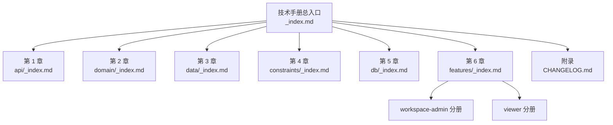
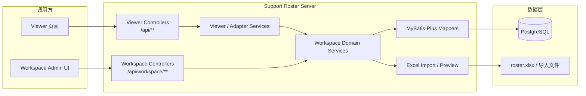

# Support Roster Server 技术手册

## 文档定位

本目录用于维护 **Support Roster Server** 的正式技术规范。文档以“技术手册 / 规格书”方式组织，目标是让读者能够从总览进入专题，再从专题进入资源级细节，而不必在零散笔记中反复跳转。

系统当前同时承载两类能力：

- **viewer 只读接口**：公开查看页，统一挂载在 `/api/**`
- **workspace 管理接口**：后台可写能力，统一挂载在 `/api/workspace/**`
- **数据与兼容链路**：运行时以 PostgreSQL 为主，同时保留 Excel 导入模板与历史 Excel 结构说明

## 阅读导引

| 章节 | 入口 | 适用场景 | 继续阅读 |
|---|---|---|---|
| 第 1 章 接口规范 | [api/_index.md](./api/_index.md) | 评审 API 契约、路由与状态码 | [api-standard.md](./api-standard.md) |
| 第 2 章 领域模型 | [domain/_index.md](./domain/_index.md) | 理解角色、团队、班次与排班规则 | [domain-logic.md](./domain-logic.md) |
| 第 3 章 数据架构 | [data/_index.md](./data/_index.md) | 追踪 Excel 来源、加载与兼容约束 | [data-architecture.md](./data-architecture.md) |
| 第 4 章 实现约束 | [constraints/_index.md](./constraints/_index.md) | 查看代码结构、异常、日志与测试约定 | [constraints-and-conventions.md](./constraints-and-conventions.md) |
| 第 5 章 数据库规范 | [db/_index.md](./db/_index.md) | 设计表结构、DDL 与初始化脚本 | [db/db-spec.md](./db/db-spec.md) |
| 第 6 章 功能专题 | [features/_index.md](./features/_index.md) | 沿功能域阅读 workspace / viewer 能力 | [features/workspace-admin/_index.md](./features/workspace-admin/_index.md)、[features/viewer/_index.md](./features/viewer/_index.md) |
| 附录 变更记录 | [CHANGELOG.md](./CHANGELOG.md) | 回溯规范演进历史 | 按日期逆序阅读 |

## 文档拓扑

## 系统架构速写

## 目录总览

| 目录 / 文档 | 角色 | 内容焦点 |
|---|---|---|
| `_index.md` | 卷首导航 | 全局目录、阅读顺序、系统速写 |
| `api/_index.md` | 接口目录 | 契约入口、OpenAPI 组织、资源阅读指引 |
| `domain/_index.md` | 领域目录 | 实体、规则、业务流程导航 |
| `data/_index.md` | 数据目录 | Excel 来源、加载索引、兼容约束导航 |
| `constraints/_index.md` | 实现约束目录 | 代码、异常、日志、测试与配置规范 |
| `db/_index.md` | 数据库目录 | 主键、审计字段、DDL 与迁移约束 |
| `features/_index.md` | 功能专题目录 | workspace / viewer 分册入口 |
| `features/workspace-admin/_index.md` | 工作台后台分册 | 写能力与后台聚合资源 |
| `features/viewer/_index.md` | Viewer 分册 | 公开只读接口资源 |
| `CHANGELOG.md` | 历史附录 | 规范变更背景、影响评估 |

## 技术基线

| 类别 | 当前基线 | 说明 |
|---|---|---|
| Runtime | `JDK 25` | Java 运行环境 |
| Framework | `Spring Boot 4.0.3` | 服务主框架 |
| Persistence | `PostgreSQL` + `MyBatis-Plus 3.5.16` | 后台主存储与 ORM |
| Import | `fesod-sheet 2.0.1-incubating` | Excel 解析 |
| Logging | `spring-boot-starter-log4j2` | 日志框架 |
| API Contract | `api/openapi.yaml` | OpenAPI 聚合入口 |

## 维护说明

- 根入口只承担**导航与上下文建立**，不承载资源级细节。
- 业务事实变更时，应优先同步对应专题文档，再回到索引页调整目录说明。
- 任何新增接口、领域规则、数据结构或数据库约束，都应保留到源码、OpenAPI 与 spec 之间的相互映射。
- 已废弃内容应保留最小必要历史说明，并明确标记为“已废弃 / 历史兼容”。
