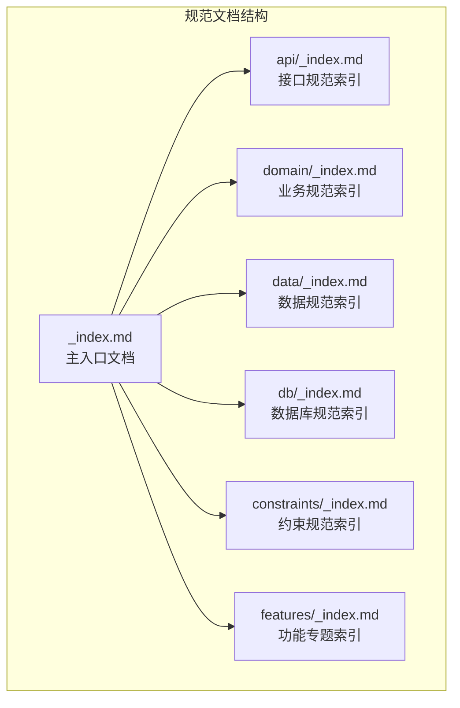
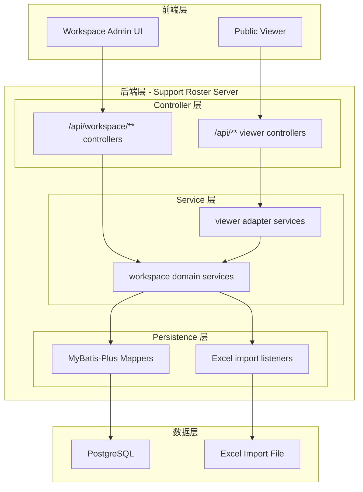

# Support Roster Server - 技术规范文档

## 项目简述

**Support Roster Server** 是一个基于 Spring Boot 的技术支持排班管理系统后端服务。该系统当前同时承载公开查看页接口与 workspace 管理后台接口，核心价值在于：

- **排班可视化管理**：为跨时区、跨团队的技术支持人员提供清晰的排班视图
- **多团队协同支持**：支持 L1、L2、L2+、L3、Incident Manager、DevOps 等多层级支持团队
- **时区智能转换**：自动处理不同地区（中国、印度、亚太、EMEA）的时区转换
- **管理后台可写**：通过 PostgreSQL + MyBatis-Plus 提供人员、班次、团队、排班、校验与导入管理能力
- **Excel 导入兼容**：保留现有 Excel 模板作为导入来源，而非运行时唯一数据源

---

## Spec 导航原则

- 正式技术规范统一维护在 `.specs/` 目录下。
- 根入口 `_index.md` 只负责总览和一级导航，不承载过多主题细节。
- 主题内容按目录拆分，优先归类到 `api/`、`domain/`、`data/`、`db/`、`constraints/`、`features/`。
- 每个主题目录通过 `_index.md` 管理本主题内的文档导航。
- 当前已有的历史根级 spec 文件继续保留并由主题索引统一引用，后续新增内容优先进入对应主题目录。

## 模块地图



## 一级目录导航

| 目录/文档 | 职责 |
|------|------|
| `_index.md` | 项目总览、技术栈清单、一级导航 |
| `api/_index.md` | API 规范导航与接口相关文档汇总 |
| `domain/_index.md` | 业务实体、流程、规则文档汇总 |
| `data/_index.md` | 数据来源、存储结构、加载机制文档汇总 |
| `db/_index.md` | 数据库设计规范、DDL 管理约定与后续建表文档汇总 |
| `constraints/_index.md` | 代码约束、实现约定、异常与日志规范汇总 |
| `features/_index.md` | 功能级专题规范入口，供后续扩展 |
| `CHANGELOG.md` | spec 变更记录 |

## 当前主题文档落点

| 主题 | 索引 | 当前主文档 |
|------|------|------|
| API | `api/_index.md` | `api-standard.md`、`api/openapi-layout.md` |
| Domain | `domain/_index.md` | `domain-logic.md` |
| Data | `data/_index.md` | `data-architecture.md` |
| DB | `db/_index.md` | `db/db-spec.md` |
| Constraints | `constraints/_index.md` | `constraints-and-conventions.md` |
| Features | `features/_index.md` | `features/workspace-admin-backend.md`、`features/workspace-admin/_index.md`、`features/viewer/_index.md` |

---

## 技术栈清单

### 核心框架

| 组件 | 版本 | 说明 |
|------|------|------|
| **JDK** | 25 | Java 运行时环境 |
| **Spring Boot** | 4.0.3 | 核心框架 |
| **Maven** | - | 构建工具 |

### 关键依赖

| 依赖 | 版本 | 用途 |
|------|------|------|
| `spring-boot-starter-web` | 4.0.3 | REST API 支持 |
| `spring-boot-starter-json` | 4.0.3 | Jackson / `ObjectMapper` 与 JSON 序列化支持 |
| `spring-boot-starter-actuator` | 4.0.3 | 健康检查与监控 |
| `spring-boot-starter-log4j2` | - | 日志框架（替代默认 Logback） |
| `spring-boot-starter-validation` | 4.0.3 | 请求校验 |
| `postgresql` | - | PostgreSQL JDBC 驱动 |
| `mybatis-plus-spring-boot4-starter` | 3.5.16 | MyBatis-Plus 持久化支持 |
| `druid-spring-boot-starter` | 1.2.27 | 数据源连接池 |
| `fesod-sheet` | 2.0.1-incubating | Excel 文件解析 |
| `lombok` | 1.18.42 | 代码简化（Getter/Setter/Builder） |

### 运行配置

| 配置项 | 值 | 说明 |
|--------|-----|------|
| 服务端口 | `8080` | 默认 HTTP 端口 |
| 应用名称 | `support-roster-server` | Spring Application Name |
| 数据库 | `jdbc:postgresql://127.0.0.1:5432/support` | 默认本地开发库 |
| Actuator 端点 | `health`, `info` | 开放的健康检查端点 |

---

## 系统架构概览



---

## 项目目录结构

```
support-roster-server/
├── api/
│   ├── openapi.yaml              # OpenAPI 3.0 聚合入口
│   ├── components/
│   │   └── common.yaml           # 共享参数、响应与 schema
│   └── paths/
│       ├── viewer/               # viewer controller 契约拆分
│       └── workspace/            # workspace controller 契约拆分
├── spec/
│   └── source_excel.md           # Excel 数据结构说明
├── src/
│   ├── main/
│   │   ├── java/com/support/server/supportrosterserver/
│   │   │   ├── config/           # 配置类
│   │   │   │   ├── CorsConfig.java
│   │   │   │   └── MybatisPlusConfig.java
│   │   │   ├── controller/       # REST 控制器
│   │   │   │   ├── workspace/
│   │   │   │   └── ...
│   │   │   ├── dto/              # 数据传输对象
│   │   │   │   ├── BackupDto.java
│   │   │   │   ├── ContactDto.java
│   │   │   │   ├── ErrorResponse.java
│   │   │   │   ├── RoleGroupDto.java
│   │   │   │   ├── ShiftDto.java
│   │   │   │   ├── StaffDto.java
│   │   │   │   └── TeamDto.java
│   │   │   ├── entity/           # 实体类
│   │   │   │   ├── workspace/
│   │   │   │   └── ...
│   │   │   ├── exception/        # 异常处理
│   │   │   │   ├── GlobalExceptionHandler.java
│   │   │   │   └── ResourceNotFoundException.java
│   │   │   ├── mapper/           # MyBatis-Plus Mapper
│   │   │   ├── repository/       # 导入解析与兼容层
│   │   │   ├── service/          # 业务逻辑层
│   │   │   │   ├── workspace/
│   │   │   │   └── ...
│   │   │   └── SupportRosterServerApplication.java
│   │   └── resources/
│   │       ├── application.yml   # 应用配置
│   │       └── schema.sql        # 本地空库初始化脚本
│   └── test/                     # 测试代码
├── pom.xml                       # Maven 配置
└── .specs/                       # 技术规范文档
    ├── _index.md
    ├── CHANGELOG.md
    ├── api-standard.md
    ├── domain-logic.md
    ├── data-architecture.md
    ├── constraints-and-conventions.md
    ├── api/
    │   └── _index.md
    ├── domain/
    │   └── _index.md
    ├── data/
    │   └── _index.md
    ├── db/
    │   ├── _index.md
    │   ├── db-spec.md
    │   └── ddl/
    │       └── README.md
    ├── constraints/
    │   └── _index.md
    └── features/
        ├── _index.md
        ├── workspace-admin-backend.md
        ├── workspace-admin/
            ├── _index.md
            ├── overview.md
            ├── dashboard-overview.md
            ├── role-groups.md
            ├── staff.md
            ├── shift-definitions.md
            ├── teams.md
            ├── roster.md
            ├── validation.md
            └── import-export.md
        └── viewer/
            ├── _index.md
            ├── overview.md
            ├── teams.md
            ├── shifts.md
            ├── staff.md
            ├── role-groups.md
            └── shift-codes.md
```

---

## 快速开始

### 启动服务

```bash
cd support-roster-server
mvn spring-boot:run
```

### 访问端点

- **API 基础路径**: `http://localhost:8080/api`
- **Workspace 管理接口**: `http://localhost:8080/api/workspace`
- **健康检查**: `http://localhost:8080/actuator/health`
- **OpenAPI 文档**: 以 `api/openapi.yaml` 为主入口，按 controller 拆分到 `api/paths/viewer/` 与 `api/paths/workspace/`

---

## 相关文档链接

- [业务逻辑规范](./domain-logic.md)
- [接口规范](./api-standard.md)
- [数据架构](./data-architecture.md)
- [约束与约定](./constraints-and-conventions.md)
