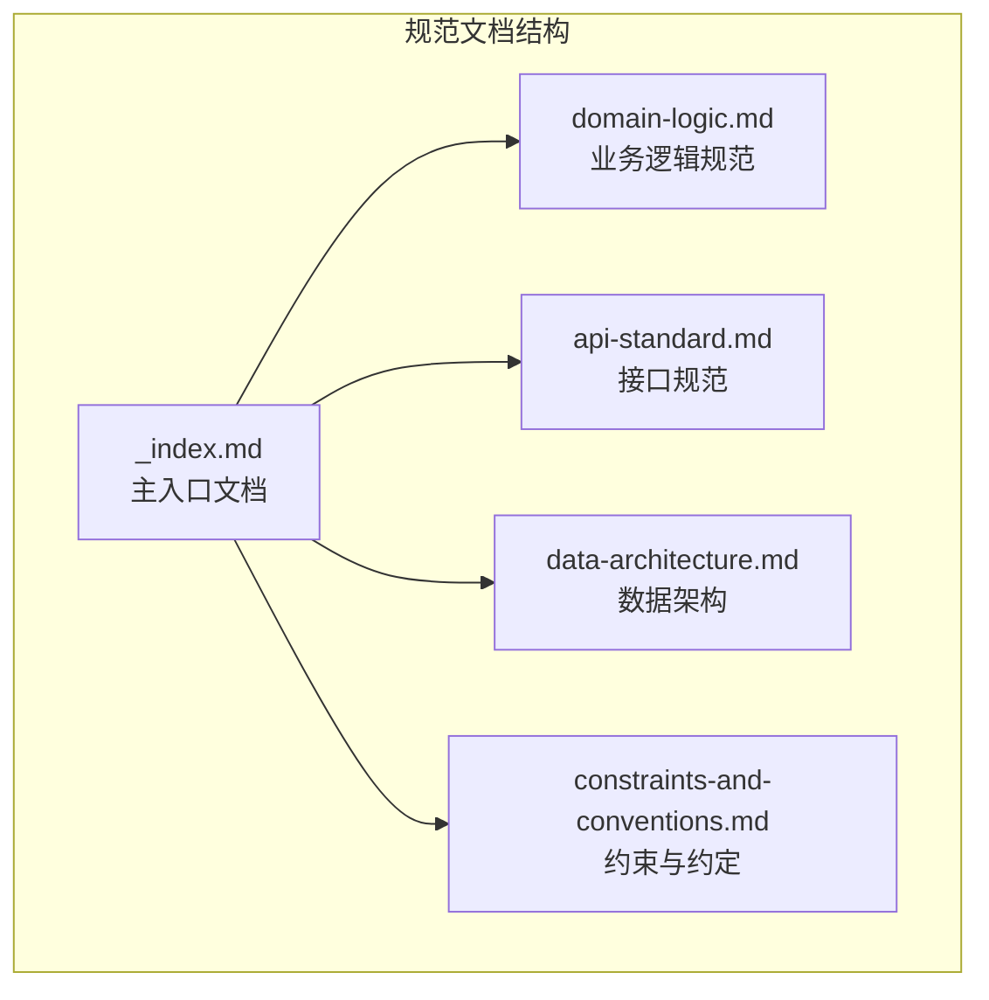
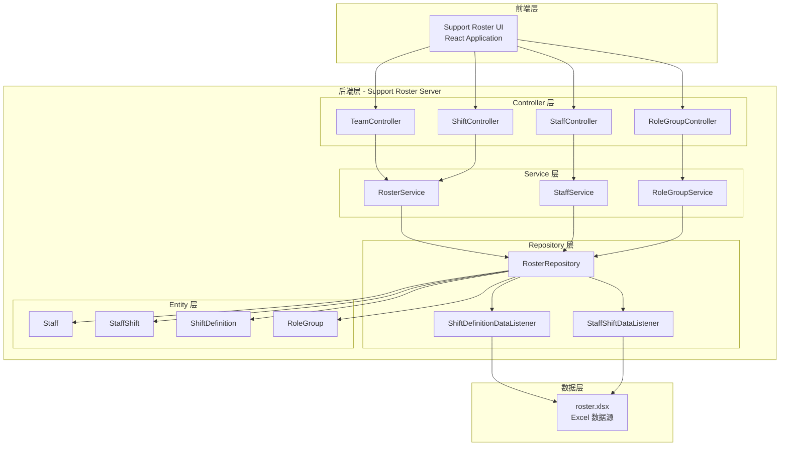

# Support Roster Server - 技术规范文档

## 项目简述

**Support Roster Server** 是一个基于 Spring Boot 的技术支持排班管理系统后端服务。该系统的核心价值在于：

- **排班可视化管理**：为跨时区、跨团队的技术支持人员提供清晰的排班视图
- **多团队协同支持**：支持 L1、L2、L2+、L3、Incident Manager、DevOps 等多层级支持团队
- **时区智能转换**：自动处理不同地区（中国、印度、亚太、EMEA）的时区转换
- **Excel 数据驱动**：以 Excel 文件作为数据源，简化运维管理

---

## 模块地图



| 文档 | 职责 |
|------|------|
| `_index.md` | 项目总览、技术栈清单、模块导航 |
| `domain-logic.md` | 核心业务实体、业务流程、排班规则 |
| `api-standard.md` | RESTful API 规范、请求/响应格式、认证机制 |
| `data-architecture.md` | Excel 存储结构、数据加载机制、索引逻辑 |
| `constraints-and-conventions.md` | 代码风格、异常处理、日志规范 |

---

## 技术栈清单

### 核心框架

| 组件 | 版本 | 说明 |
|------|------|------|
| **JDK** | 25 | Java 运行时环境 |
| **Spring Boot** | 4.0.3 | 核心框架 |
| **Maven** | - | 构建工具 |

### 关键依赖

| 依赖 | 版本 | 用途 |
|------|------|------|
| `spring-boot-starter-web` | 4.0.3 | REST API 支持 |
| `spring-boot-starter-actuator` | 4.0.3 | 健康检查与监控 |
| `spring-boot-starter-log4j2` | - | 日志框架（替代默认 Logback） |
| `fesod-sheet` | 2.0.1-incubating | Excel 文件解析 |
| `lombok` | 1.18.42 | 代码简化（Getter/Setter/Builder） |

### 运行配置

| 配置项 | 值 | 说明 |
|--------|-----|------|
| 服务端口 | `8080` | 默认 HTTP 端口 |
| 应用名称 | `support-roster-server` | Spring Application Name |
| Actuator 端点 | `health`, `info` | 开放的健康检查端点 |

---

## 系统架构概览



---

## 项目目录结构

```
support-roster-server/
├── api/
│   └── openapi.yaml              # OpenAPI 3.0 规范定义
├── spec/
│   └── source_excel.md           # Excel 数据结构说明
├── src/
│   ├── main/
│   │   ├── java/com/support/server/supportrosterserver/
│   │   │   ├── config/           # 配置类
│   │   │   │   └── CorsConfig.java
│   │   │   ├── controller/       # REST 控制器
│   │   │   │   ├── RoleGroupController.java
│   │   │   │   ├── ShiftController.java
│   │   │   │   ├── StaffController.java
│   │   │   │   └── TeamController.java
│   │   │   ├── dto/              # 数据传输对象
│   │   │   │   ├── BackupDto.java
│   │   │   │   ├── ContactDto.java
│   │   │   │   ├── ErrorResponse.java
│   │   │   │   ├── RoleGroupDto.java
│   │   │   │   ├── ShiftDto.java
│   │   │   │   ├── StaffDto.java
│   │   │   │   └── TeamDto.java
│   │   │   ├── entity/           # 实体类
│   │   │   │   ├── RoleGroup.java
│   │   │   │   ├── ShiftDefinition.java
│   │   │   │   ├── ShiftDefinitionRow.java
│   │   │   │   ├── Staff.java
│   │   │   │   ├── StaffShift.java
│   │   │   │   └── StaffShiftRow.java
│   │   │   ├── exception/        # 异常处理
│   │   │   │   ├── GlobalExceptionHandler.java
│   │   │   │   └── ResourceNotFoundException.java
│   │   │   ├── repository/       # 数据访问层
│   │   │   │   ├── RosterRepository.java
│   │   │   │   ├── ShiftDefinitionDataListener.java
│   │   │   │   └── StaffShiftDataListener.java
│   │   │   ├── service/          # 业务逻辑层
│   │   │   │   ├── RoleGroupService.java
│   │   │   │   ├── RosterService.java
│   │   │   │   └── StaffService.java
│   │   │   └── SupportRosterServerApplication.java
│   │   └── resources/
│   │       ├── application.yml   # 应用配置
│   │       └── roster.xlsx       # 排班数据源
│   └── test/                     # 测试代码
├── pom.xml                       # Maven 配置
└── .specs/                       # 技术规范文档
    ├── _index.md
    ├── domain-logic.md
    ├── api-standard.md
    ├── data-architecture.md
    └── constraints-and-conventions.md
```

---

## 快速开始

### 启动服务

```bash
cd support-roster-server
mvn spring-boot:run
```

### 访问端点

- **API 基础路径**: `http://localhost:8080/api`
- **健康检查**: `http://localhost:8080/actuator/health`
- **OpenAPI 文档**: 参考 `api/openapi.yaml`

---

## 相关文档链接

- [业务逻辑规范](./domain-logic.md)
- [接口规范](./api-standard.md)
- [数据架构](./data-architecture.md)
- [约束与约定](./constraints-and-conventions.md)
