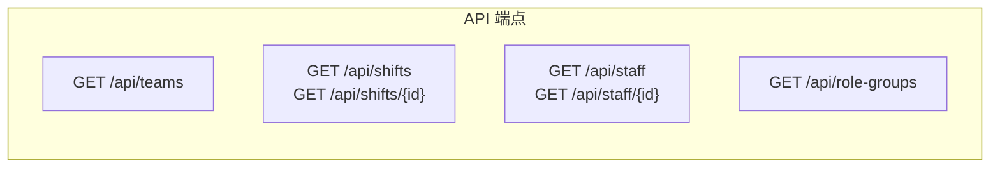
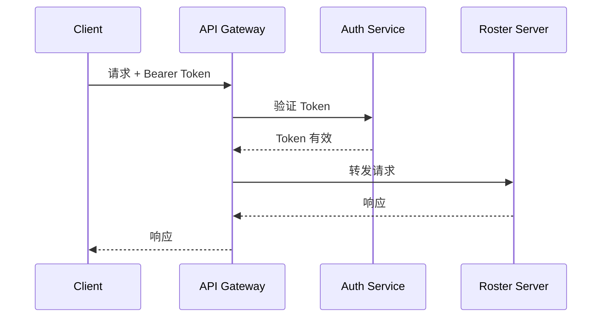

# 接口规范 (API Standard)

## 路由命名约定

### 基础路径

所有 API 端点均以 `/api` 为前缀：

```
http://localhost:8080/api
```

### 路由规范

| 规则 | 示例 | 说明 |
|------|------|------|
| 使用小写字母 | `/api/role-groups` | 避免大小写混淆 |
| 使用连字符分隔 | `/api/role-groups` | 提高可读性 |
| 使用复数形式 | `/api/teams`, `/api/staff` | RESTful 风格 |
| 资源嵌套避免过深 | `/api/shifts/{id}` | 最多一层嵌套 |

### 端点清单



---

## 公共请求/响应格式

### 请求格式

#### 查询参数

| 参数名 | 类型 | 必填 | 说明 |
|--------|------|------|------|
| `date` | `String (yyyy-MM-dd)` | 视接口而定 | 日期参数 |
| `teamId` | `String` | 否 | 团队 ID 过滤 |
| `timezone` | `String` | 否 | 时区（默认 UTC） |

#### 请求头

```
Accept: application/json
Content-Type: application/json (POST/PUT 请求)
```

### 响应格式

#### 成功响应

**HTTP 200 OK**

```json
{
  "id": "550e8400-e29b-41d4-a716-446655440000",
  "teamId": "l1",
  "staffId": 123,
  "userName": "Alex Chen",
  "code": "A",
  "start": "2024-01-15T00:00:00+08:00",
  "end": "2024-01-15T07:00:00+08:00"
}
```

#### 错误响应

**HTTP 404 Not Found / 500 Internal Server Error**

```json
{
  "timestamp": "2024-01-15T10:30:00",
  "status": 404,
  "error": "Not Found",
  "message": "Staff not found with id: '999'",
  "path": "/api/staff/999"
}
```

---

## 身份验证与授权机制

### 当前状态

**[Warning]** 当前系统 **未实现** 身份验证与授权机制。

### CORS 配置

**文件位置**: [config/CorsConfig.java](../src/main/java/com/support/server/supportrosterserver/config/CorsConfig.java)

```java
config.setAllowCredentials(true);
config.addAllowedOriginPattern("*");  // 允许所有来源
config.addAllowedHeader("*");         // 允许所有请求头
config.addAllowedMethod("*");         // 允许所有 HTTP 方法
config.addExposedHeader("*");         // 暴露所有响应头
```

**[Warning]** 当前 CORS 配置过于宽松，生产环境应限制允许的来源。

### 建议的认证方案 [TBD]



---

## 核心接口清单

### 1. 团队接口

#### GET /api/teams

获取所有团队列表。

**请求**:

```http
GET /api/teams HTTP/1.1
Host: localhost:8080
Accept: application/json
```

**响应**:

```json
[
  {
    "id": "incident-manager",
    "name": "Incident Manager",
    "color": "orange",
    "order": 0
  },
  {
    "id": "l1",
    "name": "L1",
    "color": "blue",
    "order": 1
  },
  {
    "id": "ap-l2",
    "name": "AP L2",
    "color": "green",
    "order": 2
  }
]
```

**实现位置**: [controller/TeamController.java](../src/main/java/com/support/server/supportrosterserver/controller/TeamController.java)

---

### 2. 排班接口

#### GET /api/shifts

按日期获取排班信息。

**请求参数**:

| 参数 | 类型 | 必填 | 默认值 | 说明 |
|------|------|------|--------|------|
| `date` | `String` | ✅ | - | 日期 (yyyy-MM-dd) |
| `teamId` | `String` | ❌ | - | 团队 ID 过滤 |
| `timezone` | `String` | ❌ | `UTC` | 目标时区 |

**当前实现行为说明**:

- 当 `teamId` 无法映射到后端 `roleGroup` 时，不返回空结果，也不返回 4xx，而是回退为“查询全部排班”。
- 当 `timezone` 非法时（例如无效 ZoneId），当前实现会抛出异常并返回 `500`。

**请求示例**:

```http
GET /api/shifts?date=2024-01-15&teamId=l1&timezone=Asia/Shanghai HTTP/1.1
Host: localhost:8080
Accept: application/json
```

**响应**:

```json
[
  {
    "id": "550e8400-e29b-41d4-a716-446655440000",
    "teamId": "l1",
    "staffId": 123,
    "userName": "test1",
    "userAvatar": "https://images.unsplash.com/photo-1535713875002-d1d0cf377fde?w=100",
    "code": "A",
    "meaning": "00:00-07:00",
    "start": "2024-01-15T00:00:00+08:00",
    "end": "2024-01-15T07:00:00+08:00",
    "timezone": "HKT",
    "isPrimary": true,
    "showOnRoster": true,
    "remark": null,
    "contact": {
      "slack": "@test1",
      "email": "test1@company.com",
      "phone": ""
    },
    "backup": null
  }
]
```

**实现位置**: [controller/ShiftController.java](../src/main/java/com/support/server/supportrosterserver/controller/ShiftController.java)

#### GET /api/shifts/{id}

根据 ID 获取排班详情。

**[Warning]** 当前实现返回 `null`，功能待完善。

**响应**: HTTP 404 Not Found

---

### 3. 员工接口

#### GET /api/staff

获取所有员工列表。

**请求**:

```http
GET /api/staff HTTP/1.1
Host: localhost:8080
Accept: application/json
```

**响应**:

```json
[
  {
    "id": 123,
    "name": "test1",
    "avatar": null,
    "email": null,
    "phone": null,
    "slack": null,
    "region": "China",
    "contact": null,
    "roleGroups": null
  }
]
```

**注意**：`roleGroups` 在 `GET /api/staff` 中通常为空（当前实现未填充）；`GET /api/staff/{id}` 会基于排班数据补充 `roleGroups`。

**实现位置**: [controller/StaffController.java](../src/main/java/com/support/server/supportrosterserver/controller/StaffController.java)

#### GET /api/staff/{id}

根据 ID 获取员工详情。

**路径参数**:

| 参数 | 类型 | 说明 |
|------|------|------|
| `id` | `Long` | 员工 ID |

**请求示例**:

```http
GET /api/staff/123 HTTP/1.1
Host: localhost:8080
Accept: application/json
```

**成功响应**: HTTP 200 OK

**错误响应**: HTTP 404 Not Found

```json
{
  "timestamp": "2024-01-15T10:30:00",
  "status": 404,
  "error": "Not Found",
  "message": "Staff not found with id: '999'",
  "path": "/api/staff/999"
}
```

---

### 4. 角色组接口

#### GET /api/role-groups

获取所有角色组列表。

**请求**:

```http
GET /api/role-groups HTTP/1.1
Host: localhost:8080
Accept: application/json
```

**响应**:

```json
[
  {
    "id": "L1_China",
    "name": "L1 China",
    "category": "L1",
    "region": "China"
  },
  {
    "id": "AP_L2",
    "name": "AP L2",
    "category": "L2",
    "region": "AP"
  }
]
```

**实现位置**: [controller/RoleGroupController.java](../src/main/java/com/support/server/supportrosterserver/controller/RoleGroupController.java)

---

## 数据传输对象 (DTO)

### ShiftDto

**文件位置**: [dto/ShiftDto.java](../src/main/java/com/support/server/supportrosterserver/dto/ShiftDto.java)

| 字段 | 类型 | 说明 |
|------|------|------|
| `id` | `String` | 班次唯一标识 (UUID) |
| `teamId` | `String` | 团队 ID |
| `staffId` | `Long` | 员工 ID |
| `userName` | `String` | 员工姓名 |
| `userAvatar` | `String` | 头像 URL |
| `code` | `String` | 班次代码 |
| `meaning` | `String` | 班次含义 |
| `start` | `OffsetDateTime` | 开始时间 (ISO 8601) |
| `end` | `OffsetDateTime` | 结束时间 (ISO 8601) |
| `timezone` | `String` | 时区代码 |
| `isPrimary` | `Boolean` | 是否主要班次 |
| `showOnRoster` | `Boolean` | 是否显示在排班页 |
| `remark` | `String` | 备注 |
| `contact` | `ContactDto` | 联系信息 |
| `backup` | `BackupDto` | 备份人员信息 |

### StaffDto

**文件位置**: [dto/StaffDto.java](../src/main/java/com/support/server/supportrosterserver/dto/StaffDto.java)

| 字段 | 类型 | 说明 |
|------|------|------|
| `id` | `Long` | 员工 ID |
| `name` | `String` | 姓名 |
| `avatar` | `String` | 头像 URL |
| `email` | `String` | 邮箱 |
| `phone` | `String` | 电话 |
| `slack` | `String` | Slack 账号 |
| `region` | `String` | 地区 |
| `contact` | `String` | 联系方式 |
| `roleGroups` | `List<String>` | 所属角色组 |

### TeamDto

**文件位置**: [dto/TeamDto.java](../src/main/java/com/support/server/supportrosterserver/dto/TeamDto.java)

| 字段 | 类型 | 说明 |
|------|------|------|
| `id` | `String` | 团队 ID |
| `name` | `String` | 团队名称 |
| `color` | `String` | 颜色主题 |
| `order` | `Integer` | 显示顺序 |

### RoleGroupDto

**文件位置**: [dto/RoleGroupDto.java](../src/main/java/com/support/server/supportrosterserver/dto/RoleGroupDto.java)

| 字段 | 类型 | 说明 |
|------|------|------|
| `id` | `String` | 角色组 ID |
| `name` | `String` | 显示名称 |
| `category` | `String` | 分类 |
| `region` | `String` | 地区 |

### ErrorResponse

**文件位置**: [dto/ErrorResponse.java](../src/main/java/com/support/server/supportrosterserver/dto/ErrorResponse.java)

| 字段 | 类型 | 说明 |
|------|------|------|
| `timestamp` | `LocalDateTime` | 错误时间戳 |
| `status` | `int` | HTTP 状态码 |
| `error` | `String` | 错误类型 |
| `message` | `String` | 错误消息 |
| `path` | `String` | 请求路径 |

---

## HTTP 状态码规范

| 状态码 | 场景 |
|--------|------|
| `200 OK` | 请求成功 |
| `400 Bad Request` | 请求参数格式错误（例如日期无法解析） |
| `404 Not Found` | 资源不存在 |
| `500 Internal Server Error` | 服务器内部错误 |

**[TBD]** 需补充以下状态码支持：
- `401 Unauthorized` - 未认证
- `403 Forbidden` - 无权限

---

## OpenAPI 规范

完整的 OpenAPI 3.0 规范定义位于：

**文件位置**: [api/openapi.yaml](../api/openapi.yaml)

可通过 Swagger UI 或其他 OpenAPI 工具查看交互式文档。

**[Warning] 文档漂移提醒**：`openapi.yaml` 目前包含 `GET /shift-codes`，但当前 Java Controller 尚未实现该端点。以代码实际暴露接口为准，后续需二选一修复：

1. 实现 `/api/shift-codes`。
2. 从 OpenAPI 中移除该路径定义。
