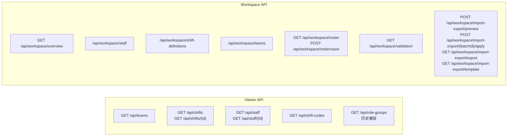

# 接口规范

## 文档定位

本文是 Support Roster Server 的 API 总体规格，统一说明：

- 路由命名空间与资源组织方式
- 通用请求 / 响应格式
- viewer 与 workspace 的接口边界
- 当前安全、兼容与错误处理约定
- DTO 速查与 OpenAPI 入口

若需要查看资源级细节，请继续阅读 [features/workspace-admin/_index.md](./features/workspace-admin/_index.md) 或 [features/viewer/_index.md](./features/viewer/_index.md)。

## 接口命名空间

| 命名空间 | 用途 | 说明 |
|---|---|---|
| `/api/**` | viewer 只读接口 | 面向公开查看页，不提供后台写操作 |
| `/api/workspace/**` | workspace 管理接口 | 面向后台管理能力 |

### 路由命名约定

| 规则 | 示例 | 说明 |
|---|---|---|
| 使用小写字母 | `/api/role-groups` | 避免大小写混淆 |
| 使用连字符分隔 | `/api/shift-codes` | 提高可读性 |
| 使用复数形式 | `/api/teams`、`/api/staff` | 保持 REST 风格 |
| 避免过深嵌套 | `/api/shifts/{id}` | 资源层级尽量扁平 |

## 接口总览



## 通用请求与响应约定

### 常见请求头

```http
Accept: application/json
Content-Type: application/json
```

### 常见查询参数

| 参数名 | 类型 | 必填 | 说明 |
|---|---|---|---|
| `date` | `String (yyyy-MM-dd)` | 视接口而定 | 日期参数 |
| `teamId` | `String` | 否 | 团队过滤 |
| `timezone` | `String` | 否 | 目标时区，默认 `UTC` |

### 成功响应示例

```json
{
  "id": "550e8400-e29b-41d4-a716-446655440000",
  "teamId": "l1",
  "staffId": 123,
  "userName": "Alex Chen",
  "code": "A",
  "start": "2024-01-15T00:00:00+08:00",
  "end": "2024-01-15T07:00:00+08:00"
}
```

### 错误响应示例

```json
{
  "timestamp": "2024-01-15T10:30:00",
  "status": 404,
  "error": "Not Found",
  "message": "Staff not found with id: '999'",
  "path": "/api/staff/999"
}
```

### 状态码约定

| 状态码 | 场景 |
|---|---|
| `200 OK` | 请求成功 |
| `400 Bad Request` | 请求参数格式错误 |
| `404 Not Found` | 资源不存在 |
| `500 Internal Server Error` | 服务端异常 |

> `TBD`：后续可补充 `401 Unauthorized` 与 `403 Forbidden` 语义。

## Viewer 接口目录

| 资源 | 路径 | 说明 | 资源文档 |
|---|---|---|---|
| 团队 | `GET /api/teams` | 返回可展示团队列表 | [features/viewer/teams.md](./features/viewer/teams.md) |
| 排班 | `GET /api/shifts` | 按日期查询排班，支持 `teamId`、`timezone` | [features/viewer/shifts.md](./features/viewer/shifts.md) |
| 排班详情 | `GET /api/shifts/{id}` | 当前实现仍不完整，存在返回 `null` 的历史说明 | [features/viewer/shifts.md](./features/viewer/shifts.md) |
| 人员 | `GET /api/staff`、`GET /api/staff/{id}` | 返回只读人员信息 | [features/viewer/staff.md](./features/viewer/staff.md) |
| 班次编码 | `GET /api/shift-codes` | 返回展示用班次编码摘要 | [features/viewer/shift-codes.md](./features/viewer/shift-codes.md) |
| 角色组 | `GET /api/role-groups` | 历史兼容说明，主链路已废弃 | [features/viewer/role-groups.md](./features/viewer/role-groups.md) |

### Viewer 当前行为说明

- `teamId` 无法映射到后端 `roleGroup` 时，不返回空结果，而是退化为查询全部排班。
- `timezone` 非法时，当前实现可能抛出异常并返回 `500`。
- `GET /api/staff` 返回的 `roleGroups` 属于历史兼容字段。

## Workspace 接口目录

| 资源 | 路径 | 说明 | 资源文档 |
|---|---|---|---|
| 总览 | `GET /api/workspace/overview` | 首页聚合视图 | [features/workspace-admin/dashboard-overview.md](./features/workspace-admin/dashboard-overview.md) |
| 人员目录 | `/api/workspace/staff` | 人员 CRUD 与筛选 | [features/workspace-admin/staff.md](./features/workspace-admin/staff.md) |
| 班次定义 | `/api/workspace/shift-definitions` | 班次定义 CRUD | [features/workspace-admin/shift-definitions.md](./features/workspace-admin/shift-definitions.md) |
| 团队 | `/api/workspace/teams` | 团队 CRUD | [features/workspace-admin/teams.md](./features/workspace-admin/teams.md) |
| 月度排班 | `GET /api/workspace/roster`、`POST /api/workspace/roster/save` | 查询与增量保存 | [features/workspace-admin/roster.md](./features/workspace-admin/roster.md) |
| 校验中心 | `GET /api/workspace/validation` | 聚合当前月问题 | [features/workspace-admin/validation.md](./features/workspace-admin/validation.md) |
| 导入导出 | `POST /api/workspace/import-export/preview`、`POST /api/workspace/import-export/{batchId}/apply`、`GET /api/workspace/import-export/export`、`GET /api/workspace/import-export/template` | 预览、应用、导出、模板下载 | [features/workspace-admin/import-export.md](./features/workspace-admin/import-export.md) |
| 角色组 | `GET /api/workspace/role-groups` | 历史兼容说明，主资源已迁移到 `team` | [features/workspace-admin/role-groups.md](./features/workspace-admin/role-groups.md) |

### Workspace 行为说明

- 排班数据按“员工 + 日期 + 班次编码”存储，而不是整月 JSON。
- 导入流程采用两阶段：`preview` → `apply`。
- 校验中心与导入预览共享问题模型与严重级别口径。
- Long 型主键在 JSON 中按字符串传输，以避免浏览器精度丢失。

## DTO 速查

### `ShiftDto`

源码：[`dto/ShiftDto.java`](../src/main/java/com/support/server/supportrosterserver/dto/ShiftDto.java)

| 字段 | 类型 | 说明 |
|---|---|---|
| `id` | `String` | 班次唯一标识 |
| `teamId` | `String` | 团队 ID |
| `staffId` | `Long` | 员工 ID |
| `userName` | `String` | 员工姓名 |
| `userAvatar` | `String` | 基于 `staffId` 实时拼接 |
| `code` | `String` | 班次代码 |
| `meaning` | `String` | 班次含义 |
| `start` | `OffsetDateTime` | 开始时间 |
| `end` | `OffsetDateTime` | 结束时间 |
| `timezone` | `String` | 时区代码 |
| `isPrimary` | `Boolean` | 是否主班次 |
| `showOnRoster` | `Boolean` | 是否显示 |
| `remark` | `String` | 备注 |
| `contact` | `ContactDto` | 联系方式 |
| `backup` | `BackupDto` | 备份人员信息 |

### `StaffDto`

源码：[`dto/StaffDto.java`](../src/main/java/com/support/server/supportrosterserver/dto/StaffDto.java)

| 字段 | 类型 | 说明 |
|---|---|---|
| `id` | `Long` | 员工 ID |
| `name` | `String` | 姓名 |
| `avatar` | `String` | 头像 URL |
| `email` | `String` | 邮箱 |
| `phone` | `String` | 电话 |
| `slack` | `String` | Slack |
| `region` | `String` | 地区 |
| `contact` | `String` | 联系方式摘要 |
| `roleGroups` | `List<String>` | 历史兼容字段 |

### `TeamDto`

源码：[`dto/TeamDto.java`](../src/main/java/com/support/server/supportrosterserver/dto/TeamDto.java)

| 字段 | 类型 | 说明 |
|---|---|---|
| `id` | `String` | 团队 ID |
| `name` | `String` | 团队名称 |
| `color` | `String` | 颜色主题 |
| `order` | `Integer` | 展示顺序 |

### `RoleGroupDto`

源码说明：当前仓库中已无独立 `RoleGroupDto.java`，该结构仅作为历史兼容接口模型在规范中保留。

| 字段 | 类型 | 说明 |
|---|---|---|
| `id` | `String` | 角色组 ID |
| `name` | `String` | 显示名称 |
| `category` | `String` | 分类 |
| `region` | `String` | 地区 |

### `ErrorResponse`

源码：[`dto/ErrorResponse.java`](../src/main/java/com/support/server/supportrosterserver/dto/ErrorResponse.java)

| 字段 | 类型 | 说明 |
|---|---|---|
| `timestamp` | `LocalDateTime` | 错误时间 |
| `status` | `int` | HTTP 状态码 |
| `error` | `String` | 错误类型 |
| `message` | `String` | 错误消息 |
| `path` | `String` | 请求路径 |

## 当前安全边界与兼容说明

### 身份验证与授权

- 当前系统**未实现**身份验证与授权机制。
- 管理接口与 viewer 接口均由同一服务直接暴露。

### CORS

相关实现位置：[`config/CorsConfig.java`](../src/main/java/com/support/server/supportrosterserver/config/CorsConfig.java)

- 当前策略以 `/api/**` 为全局跨域范围。
- 若未来需要跨域 Cookie / Session，必须改为显式来源白名单策略。

### 兼容提示

- viewer 侧旧路由仍保留，不迁移到 `/api/workspace/**`。
- 历史 `role-group` 接口与字段应视为兼容层，而非新的主模型入口。

## OpenAPI 与源码入口

| 类型 | 入口 |
|---|---|
| OpenAPI 聚合入口 | [../api/openapi.yaml](../api/openapi.yaml) |
| OpenAPI 目录说明 | [api/openapi-layout.md](./api/openapi-layout.md) |
| viewer 路径目录 | [../api/paths/viewer](../api/paths/viewer) |
| workspace 路径目录 | [../api/paths/workspace](../api/paths/workspace) |
| controller 源码 | [../src/main/java/com/support/server/supportrosterserver/controller](../src/main/java/com/support/server/supportrosterserver/controller) |
| workspace controller 源码 | [../src/main/java/com/support/server/supportrosterserver/controller/workspace](../src/main/java/com/support/server/supportrosterserver/controller/workspace) |

## 维护提示

- 总体规范负责“通用约定”，资源级字段细节应落到 feature 文档。
- 若 OpenAPI、源码与本文不一致，应以源码与契约比对后同步修正三者。
