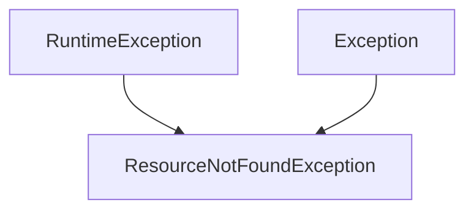

# 约束与约定

## 文档定位

本文统一描述实现层约束，包括包结构、命名规则、依赖注入、异常处理、日志、测试与配置管理。它为编码方式提供边界，但不替代 API、领域或数据库文档。

## 代码组织

### 包结构

```text
com.support.server.supportrosterserver/
├── config/
├── controller/
├── dto/
├── entity/
├── exception/
├── repository/
└── service/
```

### 命名约定

| 类型 | 规则 | 示例 |
|---|---|---|
| 类名 | PascalCase | `RosterService`、`ShiftController` |
| 方法名 | camelCase | `getShiftsByDate()` |
| 常量 | UPPER_SNAKE_CASE | `PRIMARY_CODES` |
| 包名 | 全小写 | `com.support.server.supportrosterserver` |
| DTO | 实体名 + `Dto` | `StaffDto`、`ShiftDto` |
| Controller | 资源名 + `Controller` | `StaffController` |
| Service | 资源名 + `Service` | `WorkspaceRosterService` |
| Repository | 资源名 + `Repository` | `RosterRepository` |

### Lombok 约定

| 注解 | 用途 | 常见场景 |
|---|---|---|
| `@Data` | getter / setter / equals / hashCode | DTO、实体 |
| `@NoArgsConstructor` | 无参构造 | DTO、实体 |
| `@AllArgsConstructor` | 全参构造 | DTO |
| `@RequiredArgsConstructor` | `final` 字段构造注入 | Service、Controller |
| `@Getter` / `@Setter` | 细粒度生成 | 特殊场景 |

## 依赖与配置约束

### JSON 依赖

- 使用 `ObjectMapper`、`JsonProcessingException`、Jackson 注解或 JSON HTTP 消息转换时，必须显式声明 `spring-boot-starter-json`。
- 服务类优先通过 Spring 注入 `ObjectMapper`，避免手工 `new ObjectMapper()` 导致全局序列化配置不一致。
- 当前运行基线为 Spring Boot 4，HTTP JSON 消息转换使用 Boot 管理的 Jackson 3（`tools.jackson.*`）。
- `sa-token-spring-boot3-starter` 会自动安装 `sa-token-jackson` 插件，该插件仍依赖 Jackson 2（`com.fasterxml.jackson.*`）的 `jackson-core`、`jackson-databind` 与 `jackson-datatype-jsr310`。因此 `pom.xml` 必须显式保留这三个 Jackson 2 运行时依赖，并通过 `sa-token-jackson2.version` 固定到可解析的兼容版本；不要移除为“重复 JSON 依赖”。
- `jackson-2-bom.version` 仍需保留在 Spring Boot 4 兼容的版本，用于提供 Jackson 3 运行时需要的 `com.fasterxml.jackson.annotation` 兼容注解。

### 全局 CORS

- Spring MVC 应优先使用 `WebMvcConfigurer#addCorsMappings` 定义全局跨域规则。
- 当前项目公共 HTTP 接口统一挂在 `/api/**`，跨域范围也应限制在 `/api/**`。
- 允许所有来源访问时，推荐 `allowedOrigins("*") + allowCredentials(false)`，不要配置“任意来源 + 凭证”。
- 若未来必须支持 Cookie / Session，应改为显式来源白名单，并同步更新测试与规范。

## 异常处理



### 当前异常体系

| 元素 | 说明 | 源码 |
|---|---|---|
| `ResourceNotFoundException` | 资源不存在时抛出 | [exception/ResourceNotFoundException.java](../src/main/java/com/support/server/supportrosterserver/exception/ResourceNotFoundException.java) |
| `GlobalExceptionHandler` | 统一捕获异常并返回错误响应 | [exception/GlobalExceptionHandler.java](../src/main/java/com/support/server/supportrosterserver/exception/GlobalExceptionHandler.java) |
| `ErrorResponse` | 统一错误响应模型 | [dto/ErrorResponse.java](../src/main/java/com/support/server/supportrosterserver/dto/ErrorResponse.java) |

### 错误响应格式

```json
{
  "timestamp": "2024-01-15T10:30:00",
  "status": 404,
  "error": "Not Found",
  "message": "Staff not found with id: '999'",
  "path": "/api/staff/999"
}
```

### 当前处理约定

| 场景 | 当前做法 |
|---|---|
| 资源不存在 | `ResourceNotFoundException` → `404` |
| 参数验证失败 | `TBD`，建议补充 `@Valid` → `400` |
| 业务规则违反 | `TBD`，建议补充业务异常 → `422` |
| 系统异常 | 全局处理器兜底 → `500` |

## 日志约定

- 项目使用 **Log4j2**，对应依赖为 `spring-boot-starter-log4j2`。
- 推荐记录层次：
  - `INFO`：关键业务操作、系统状态
  - `DEBUG`：调试与流程细节
  - `WARN`：潜在问题或退化路径
  - `ERROR`：异常与失败
- 禁止记录密码、API 密钥、认证 Token 与个人敏感信息。

> `Warning`：当前代码中的日志实现仍不完整，后续应补充 controller、service 与全局异常日志。

## 依赖注入

- 推荐使用 `@RequiredArgsConstructor` + `final` 字段实现构造器注入。
- 优势包括：依赖显式、字段不可变、便于测试、降低空指针风险。

## API 设计约定

| HTTP 方法 | 用途 | 示例 |
|---|---|---|
| `GET` | 查询资源 | `GET /api/staff` |
| `POST` | 创建资源 | `POST /api/staff` |
| `PUT` | 全量更新 | `PUT /api/staff/123` |
| `PATCH` | 部分更新 | `PATCH /api/staff/123` |
| `DELETE` | 删除资源 | `DELETE /api/staff/123` |

- 统一使用 `ResponseEntity<T>` 封装响应。
- 资源路径采用小写、复数、连字符风格。

## 测试约定

| 项目 | 规则 |
|---|---|
| 单元测试命名 | `{ClassName}Test.java` |
| 集成测试命名 | `{ClassName}IT.java` |
| 推荐覆盖 | Service 层逻辑、Controller 集成、边界条件、异常场景 |

- 当前项目显式固定 `maven-surefire-plugin` 版本为 `3.5.4`，避免 Spring Boot parent 管理到当前仓库源无法稳定解析的版本后导致 `mvn test` 在测试执行前失败。

> `Warning`：当前测试覆盖率仍偏低，需继续补充。

## 配置管理

### 当前基础配置

- 应用名：`support-roster-server`
- 端口：`8080`
- Actuator 暴露：`health`、`info`

### 环境配置建议 `TBD`

```text
application.yml
application-dev.yml
application-test.yml
application-prod.yml
```

## 待改进项清单

| 优先级 | 项目 | 说明 |
|---|---|---|
| 🔴 高 | 身份验证 | 实现认证授权机制 |
| 🔴 高 | 参数校验 | 添加 `@Valid` 校验 |
| 🟡 中 | 日志记录 | 完善各层日志 |
| 🟡 中 | 异常处理 | 增加业务异常类 |
| 🟡 中 | 测试覆盖 | 提高测试覆盖率 |
| 🟢 低 | 数据库迁移 | 从 Excel 历史链路继续向数据库收敛 |
| 🟢 低 | API 文档 | 集成 Swagger / Knife4j |

## 维护提示

- 对尚未落地的约定，应保留 `TBD` 或 `Warning` 标记，不把计划性内容写成既成事实。
- 若实现约定与 feature 文档冲突，应优先核对源码，再同步修正两侧文档。
