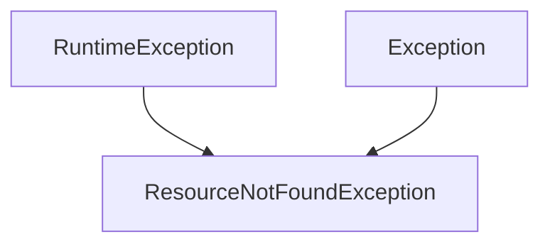

# 约束与约定 (Constraints and Conventions)

## 代码风格约束

### 包结构规范

```
com.support.server.supportrosterserver/
├── config/           # 配置类
├── controller/       # REST 控制器
├── dto/              # 数据传输对象
├── entity/           # 实体类
├── exception/        # 异常类
├── repository/       # 数据访问层
└── service/          # 业务逻辑层
```

### 命名约定

| 类型 | 命名规则 | 示例 |
|------|----------|------|
| 类名 | PascalCase | `RosterService`, `ShiftController` |
| 方法名 | camelCase | `getShiftsByDate()`, `findStaffById()` |
| 常量 | UPPER_SNAKE_CASE | `PRIMARY_CODES`, `TEAM_MAPPING` |
| 包名 | 全小写 | `com.support.server.supportrosterserver` |
| DTO 类 | 实体名 + Dto | `StaffDto`, `ShiftDto` |
| Entity 类 | 业务概念名 | `Staff`, `ShiftDefinition` |
| Controller | 资源名 + Controller | `StaffController` |
| Service | 资源名 + Service | `RosterService` |
| Repository | 资源名 + Repository | `RosterRepository` |

### Lombok 使用规范

项目使用 Lombok 简化代码，常用注解：

| 注解 | 用途 | 使用场景 |
|------|------|----------|
| `@Data` | 生成 getter/setter/toString/equals/hashCode | 实体类、DTO |
| `@NoArgsConstructor` | 无参构造函数 | 实体类、DTO |
| `@AllArgsConstructor` | 全参构造函数 | DTO、配置类 |
| `@RequiredArgsConstructor` | final 字段构造函数 | Service、Controller (依赖注入) |
| `@Getter` / `@Setter` | 单独生成 getter/setter | 特殊场景 |

**示例**:

```java
@Data
@NoArgsConstructor
@AllArgsConstructor
public class ShiftDto {
    private String id;
    private String teamId;
    private Long staffId;
    // ...
}

@Service
@RequiredArgsConstructor
public class RosterService {
    private final RosterRepository rosterRepository;
    // 自动注入，无需 @Autowired
}
```

### 代码组织

#### Controller 层

```java
@RestController
@RequestMapping("/api/shifts")
@RequiredArgsConstructor
public class ShiftController {
    
    private final RosterService rosterService;
    
    @GetMapping
    public ResponseEntity<List<ShiftDto>> getShiftsByDate(...) {
        return ResponseEntity.ok(rosterService.getShiftsByDate(...));
    }
}
```

#### Service 层

```java
@Service
@RequiredArgsConstructor
public class RosterService {
    
    private final RosterRepository rosterRepository;
    
    // 常量定义
    private static final Map<String, TeamDto> TEAM_MAPPING = Map.ofEntries(...);
    private static final Set<String> PRIMARY_CODES = Set.of(...);
    
    // 公共方法
    public List<ShiftDto> getShiftsByDate(...) { ... }
    
    // 私有辅助方法
    private ShiftDto convertToShiftDto(...) { ... }
    private boolean isPrimaryShift(String code) { ... }
}
```

#### Repository 层

```java
@Repository
public class RosterRepository {
    
    // 内存存储
    private Map<String, ShiftDefinition> shiftDefinitionMap = new HashMap<>();
    private List<StaffShift> staffShifts = new ArrayList<>();
    
    @PostConstruct
    public void init() {
        loadRosterData();
    }
    
    // 查询方法
    public ShiftDefinition findShiftDefinition(String roleGroup, String code) { ... }
}
```

### 构建依赖约束

#### Spring Boot 4 JSON 依赖

- 使用 `ObjectMapper`、`JsonProcessingException`、Jackson 注解或需要 JSON HTTP 消息转换时，必须在 `pom.xml` 中显式声明 `spring-boot-starter-json`。
- 不要假设 `spring-boot-starter-web` 一定会在当前项目依赖图中传递提供 Jackson 编译类路径；新增 JSON 序列化/反序列化逻辑时，应同时检查对应 starter 是否已声明。
- 服务类中优先通过 Spring 注入 `ObjectMapper`，避免手工 new 实例导致全局序列化配置不一致。

---

## 异常处理机制

### 异常类层次



### 自定义异常

#### ResourceNotFoundException

**文件位置**: [exception/ResourceNotFoundException.java](../src/main/java/com/support/server/supportrosterserver/exception/ResourceNotFoundException.java)

```java
public class ResourceNotFoundException extends RuntimeException {
    public ResourceNotFoundException(String message) {
        super(message);
    }
    
    public ResourceNotFoundException(String resourceName, String fieldName, Object fieldValue) {
        super(String.format("%s not found with %s: '%s'", resourceName, fieldName, fieldValue));
    }
}
```

**使用示例**:

```java
@GetMapping("/{id}")
public ResponseEntity<StaffDto> getStaffById(@PathVariable Long id) {
    StaffDto staff = staffService.getStaffById(id);
    if (staff == null) {
        throw new ResourceNotFoundException("Staff", "id", id);
    }
    return ResponseEntity.ok(staff);
}
```

### 全局异常处理器

**文件位置**: [exception/GlobalExceptionHandler.java](../src/main/java/com/support/server/supportrosterserver/exception/GlobalExceptionHandler.java)

```java
@RestControllerAdvice
public class GlobalExceptionHandler {
    
    @ExceptionHandler(ResourceNotFoundException.class)
    public ResponseEntity<ErrorResponse> handleResourceNotFound(
            ResourceNotFoundException ex,
            WebRequest request) {
        ErrorResponse error = new ErrorResponse(
            HttpStatus.NOT_FOUND.value(),
            "Not Found",
            ex.getMessage(),
            request.getDescription(false).replace("uri=", "")
        );
        return new ResponseEntity<>(error, HttpStatus.NOT_FOUND);
    }
    
    @ExceptionHandler(Exception.class)
    public ResponseEntity<ErrorResponse> handleGlobalException(
            Exception ex,
            WebRequest request) {
        ErrorResponse error = new ErrorResponse(
            HttpStatus.INTERNAL_SERVER_ERROR.value(),
            "Internal Server Error",
            ex.getMessage(),
            request.getDescription(false).replace("uri=", "")
        );
        return new ResponseEntity<>(error, HttpStatus.INTERNAL_SERVER_ERROR);
    }
}
```

### 错误响应格式

```json
{
  "timestamp": "2024-01-15T10:30:00",
  "status": 404,
  "error": "Not Found",
  "message": "Staff not found with id: '999'",
  "path": "/api/staff/999"
}
```

### 异常处理最佳实践

| 场景 | 处理方式 |
|------|----------|
| 资源不存在 | 抛出 `ResourceNotFoundException` → 404 |
| 参数验证失败 | [TBD] 需实现 `@Valid` 校验 → 400 |
| 业务规则违反 | [TBD] 需定义业务异常 → 422 |
| 系统异常 | 由全局处理器捕获 → 500 |

---

## 日志记录标准

### 日志框架

项目使用 **Log4j2** 作为日志框架（替代默认的 Logback）。

**pom.xml 配置**:

```xml
<dependency>
    <groupId>org.springframework.boot</groupId>
    <artifactId>spring-boot-starter-log4j2</artifactId>
</dependency>
```

### 日志级别

| 级别 | 使用场景 |
|------|----------|
| `ERROR` | 系统错误、异常 |
| `WARN` | 潜在问题、不推荐的操作 |
| `INFO` | 关键业务操作、系统状态 |
| `DEBUG` | 调试信息、详细流程 |
| `TRACE` | 最详细的追踪信息 |

### 日志规范 [TBD]

**[Warning]** 当前代码中未实现日志记录，建议添加以下日志：

#### Controller 层日志

```java
@Slf4j
@RestController
public class ShiftController {
    
    @GetMapping
    public ResponseEntity<List<ShiftDto>> getShiftsByDate(
            @RequestParam LocalDate date,
            @RequestParam(required = false) String teamId,
            @RequestParam(required = false, defaultValue = "UTC") String timezone) {
        log.info("Fetching shifts for date: {}, teamId: {}, timezone: {}", date, teamId, timezone);
        // ...
    }
}
```

#### Service 层日志

```java
@Slf4j
@Service
public class RosterService {
    
    public List<ShiftDto> getShiftsByDate(LocalDate date, String teamId, String timezone) {
        log.debug("Processing shift query for date: {}", date);
        // ...
        log.info("Found {} shifts for date: {}", shifts.size(), date);
        return shifts;
    }
}
```

#### 异常日志

```java
@RestControllerAdvice
public class GlobalExceptionHandler {
    
    @ExceptionHandler(Exception.class)
    public ResponseEntity<ErrorResponse> handleGlobalException(Exception ex, WebRequest request) {
        log.error("Unexpected error occurred: {}", ex.getMessage(), ex);
        // ...
    }
}
```

### 敏感信息保护

**禁止**在日志中记录以下信息：
- 密码
- API 密钥
- 个人敏感信息（如完整身份证号、银行卡号）
- 认证 Token

---

## 依赖注入规范

### 构造器注入（推荐）

使用 `@RequiredArgsConstructor` + `final` 字段：

```java
@Service
@RequiredArgsConstructor
public class RosterService {
    private final RosterRepository rosterRepository;
    // 自动生成构造器注入
}
```

### 优势

1. **不可变性**：依赖字段为 `final`，确保初始化后不可变
2. **可测试性**：便于单元测试中 Mock 依赖
3. **明确依赖**：构造器参数明确列出所有依赖
4. **避免空指针**：Spring 保证构造器注入的依赖非空

---

## API 设计规范

### RESTful 设计原则

| HTTP 方法 | 用途 | 示例 |
|-----------|------|------|
| `GET` | 查询资源 | `GET /api/staff` |
| `POST` | 创建资源 | `POST /api/staff` |
| `PUT` | 更新资源（全量） | `PUT /api/staff/123` |
| `PATCH` | 更新资源（部分） | `PATCH /api/staff/123` |
| `DELETE` | 删除资源 | `DELETE /api/staff/123` |

### 响应封装

统一使用 `ResponseEntity<T>` 封装响应：

```java
// 成功响应
return ResponseEntity.ok(data);

// 创建成功
return ResponseEntity.created(uri).body(createdResource);

// 无内容
return ResponseEntity.noContent().build();

// 未找到
return ResponseEntity.notFound().build();
```

---

## 测试规范

### 测试类命名

- 单元测试：`{ClassName}Test.java`
- 集成测试：`{ClassName}IT.java`

### 测试结构

```java
@SpringBootTest
class RosterServiceTest {
    
    @Autowired
    private RosterService rosterService;
    
    @Test
    void getShiftsByDate_shouldReturnShifts_whenDateIsValid() {
        // Given
        LocalDate date = LocalDate.of(2024, 1, 15);
        
        // When
        List<ShiftDto> shifts = rosterService.getShiftsByDate(date, null, "UTC");
        
        // Then
        assertThat(shifts).isNotEmpty();
    }
}
```

### 测试覆盖要求 [TBD]

**[Warning]** 当前测试覆盖率较低，建议补充：
- Service 层单元测试
- Controller 层集成测试
- 边界条件测试
- 异常场景测试

---

## 配置管理

### 配置文件

**application.yml**:

```yaml
spring:
  application:
    name: support-roster-server

server:
  port: 8080

management:
  endpoints:
    web:
      exposure:
        include: health,info
```

### 环境配置 [TBD]

建议添加多环境配置：

```
application.yml           # 公共配置
application-dev.yml       # 开发环境
application-test.yml      # 测试环境
application-prod.yml      # 生产环境
```

---

## 待改进项清单

| 优先级 | 项目 | 说明 |
|--------|------|------|
| 🔴 高 | 身份验证 | 实现认证授权机制 |
| 🔴 高 | 参数校验 | 添加 `@Valid` 校验 |
| 🟡 中 | 日志记录 | 完善各层日志 |
| 🟡 中 | 异常处理 | 添加业务异常类 |
| 🟡 中 | 测试覆盖 | 提高测试覆盖率 |
| 🟢 低 | 数据库迁移 | 从 Excel 迁移到数据库 |
| 🟢 低 | API 文档 | 集成 Swagger/Knife4j |
