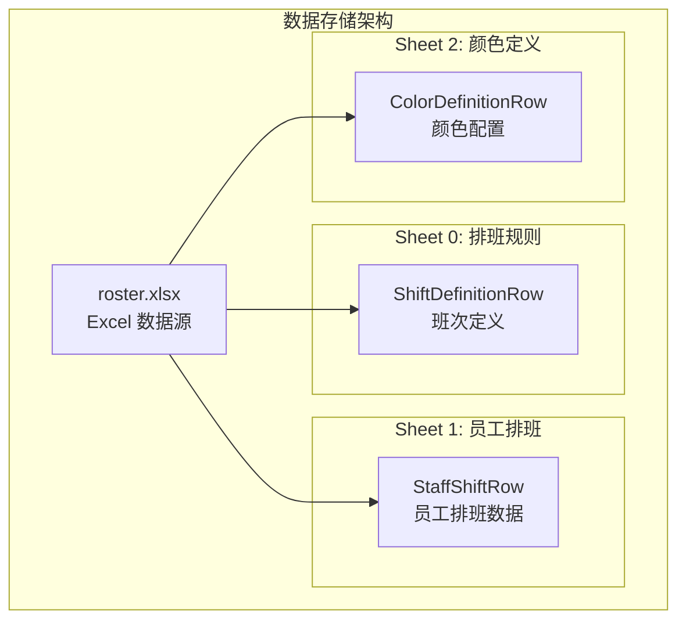
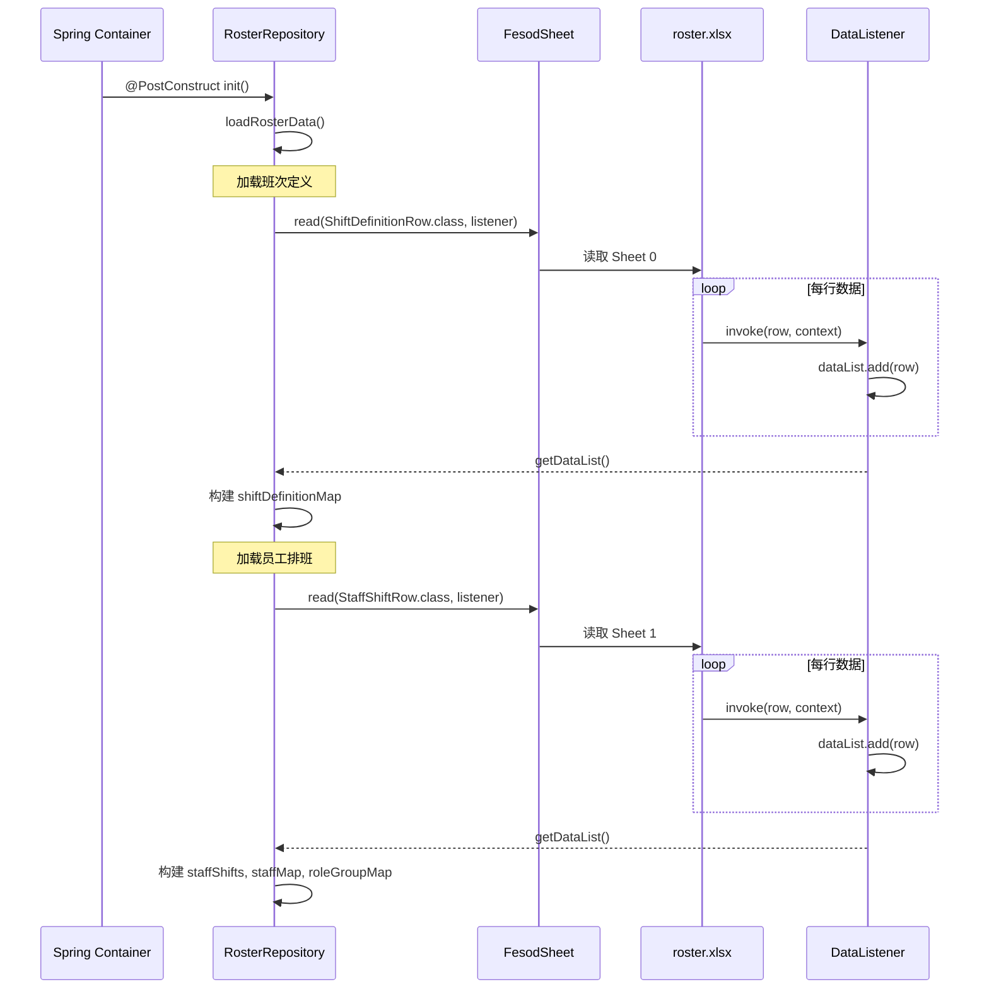
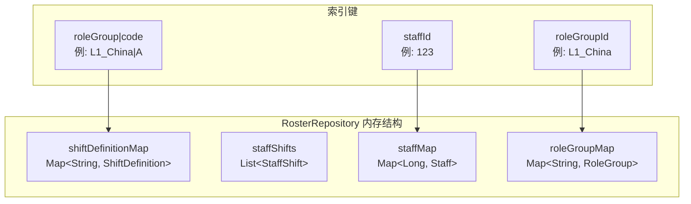
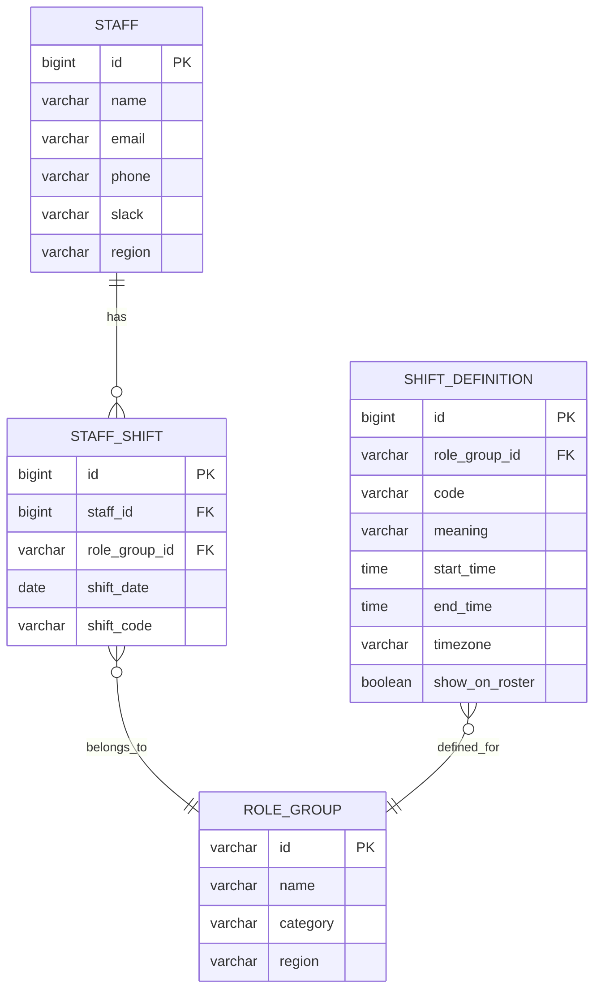

# 数据架构 (Data Architecture)

## 数据存储方案

### 存储类型

当前系统采用 **Excel 文件** 作为数据存储方案，而非传统数据库。



### 存储位置

```
src/main/resources/roster.xlsx
```

**[Warning]** Excel 文件打包在 JAR 中，运行时修改需要重新部署。生产环境建议迁移至数据库。

**运行时说明（当前实现）**：数据在应用启动时一次性加载到内存；运行过程中不会自动重载 Excel 内容。

---

## Excel 存储结构

### Sheet 0: 排班规则 (Shift Definitions)

**实体类**: [entity/ShiftDefinitionRow.java](../src/main/java/com/support/server/supportrosterserver/entity/ShiftDefinitionRow.java)

| 列索引 | 字段名 | 数据类型 | 说明 | 示例 |
|--------|--------|----------|------|------|
| 0 | `roleGroup` | String | 角色组名称 | `L1_China` |
| 1 | `code` | String | 班次代码 | `A` |
| 2 | `meaning` | String | 班次含义 | `00:00-07:00` |
| 3 | `startTime` | String | 开始时间 | `00:00:00` |
| 4 | `endTime` | String | 结束时间 | `07:00:00` |
| 5 | `timezone` | String | 时区代码 | `HKT` |
| 6 | `showOnRosterPage` | String | 是否显示 | `Y` / `N` |
| 7 | `remark` | String | 备注 | `Primary IM` |

**数据示例**:

| role_group | code | meaning | start_time | end_time | timezone | show | remark |
|------------|------|---------|------------|----------|----------|------|--------|
| L1_China | A | 00:00-07:00 | 00:00:00 | 07:00:00 | HKT | Y | |
| L1_China | B | 06:30-15:30 | 06:30:00 | 15:30:00 | HKT | Y | |
| L1_China | D | 15:30-00:30 | 15:30:00 | 00:30:00 | HKT | Y | |
| Incident_Manager_China | OC | Full Day Oncall | 00:00:00 | 23:59:00 | HKT | Y | Primary IM |

### Sheet 1: 员工排班 (Staff Shifts)

**实体类**: [entity/StaffShiftRow.java](../src/main/java/com/support/server/supportrosterserver/entity/StaffShiftRow.java)

| 列索引 | 字段名 | 数据类型 | 说明 | 示例 |
|--------|--------|----------|------|------|
| 0 | `name` | String | 员工姓名 | `test1` |
| 1 | `staffId` | String | 员工 ID | `123` |
| 2 | `roleGroup` | String | 角色组 | `L1_China` |
| 3 | `region` | String | 地区 | `China` |
| 4 | `contact` | String | 联系方式 | `+86-xxx` |
| 5 | `notes` | String | 备注 | |
| 6-36 | `day1` - `day31` | String | 每日班次代码 | `A`, `B`, `HoL` |

**数据示例**:

| name | staff_id | role_group | region | contact | notes | 1 | 2 | 3 | ... | 31 |
|------|----------|------------|--------|---------|-------|---|---|---|-----|-----|
| test1 | 123 | L1_China | China | | | A | HoL | B | ... | |
| test2 | 124 | L1_India | India | | | B | HoL | A | ... | |
| test7 | 129 | Incident_Manager_China | China | | | OC | HoL | | ... | |

### Sheet 2: 颜色定义 (Color Definitions)

**[Warning]** 当前代码中 **未使用** Sheet 2 的颜色定义数据，颜色配置硬编码在前端或 `RosterService.TEAM_MAPPING` 中。

| 列索引 | 字段名 | 数据类型 | 说明 | 示例 |
|--------|--------|----------|------|------|
| 0 | `code` | String | 班次代码 | `A` |
| 1 | `colorName` | String | 颜色名称 | `Orange` |
| 2 | `rgb` | String | RGB 值 | `255 165 0` |
| 3 | `hex` | String | 十六进制颜色 | `#FFA500` |

---

## 数据加载机制

### 加载流程



### 数据监听器

#### ShiftDefinitionDataListener

**文件位置**: [repository/ShiftDefinitionDataListener.java](../src/main/java/com/support/server/supportrosterserver/repository/ShiftDefinitionDataListener.java)

```java
public class ShiftDefinitionDataListener extends AnalysisEventListener<ShiftDefinitionRow> {
    private List<ShiftDefinitionRow> dataList = new ArrayList<>();
    
    @Override
    public void invoke(ShiftDefinitionRow data, AnalysisContext context) {
        dataList.add(data);
    }
    
    @Override
    public void onException(Exception exception, AnalysisContext context) {
        throw new ExcelAnalysisException("Excel解析异常", exception);
    }
}
```

#### StaffShiftDataListener

**文件位置**: [repository/StaffShiftDataListener.java](../src/main/java/com/support/server/supportrosterserver/repository/StaffShiftDataListener.java)

结构同上，处理 `StaffShiftRow` 类型数据。

---

## 内存数据结构

### RosterRepository 数据存储

**文件位置**: [repository/RosterRepository.java](../src/main/java/com/support/server/supportrosterserver/repository/RosterRepository.java)



### 索引逻辑

#### 1. 班次定义索引

**键格式**: `{roleGroup}|{code}`

```java
String key = roleGroup + "|" + code;  // 例: "L1_China|A"
shiftDefinitionMap.put(key, def);
```

**查询**:

```java
public ShiftDefinition findShiftDefinition(String roleGroup, String code) {
    String key = roleGroup + "|" + code;
    return shiftDefinitionMap.get(key);
}
```

#### 2. 员工索引

**键**: `staffId` (Long)

```java
staffMap.put(staffId, staff);
```

**查询**:

```java
public Staff findStaffById(Long id) {
    return staffMap.get(id);
}
```

#### 3. 角色组索引

**键**: `roleGroupId` (String)

```java
roleGroupMap.put(roleGroup, rg);
```

**查询**:

```java
public RoleGroup findRoleGroupById(String id) {
    return roleGroupMap.get(id);
}
```

---

## 数据转换规则

### Excel Row → Entity

#### ShiftDefinitionRow → ShiftDefinition

```java
ShiftDefinition def = new ShiftDefinition();
def.setRoleGroup(row.getRoleGroup());
def.setCode(row.getCode());
def.setMeaning(row.getMeaning());
def.setStartTime(row.getStartTime());
def.setEndTime(row.getEndTime());
def.setTimezone(row.getTimezone());
def.setShowOnRosterPage("Y".equalsIgnoreCase(row.getShowOnRosterPage()));
def.setRemark(row.getRemark());
```

#### StaffShiftRow → StaffShift

```java
StaffShift staffShift = new StaffShift();
staffShift.setStaffId(parseLong(row.getStaffId()));
staffShift.setName(row.getName());
staffShift.setRoleGroup(row.getRoleGroup());
staffShift.setRegion(row.getRegion());
staffShift.setContact(row.getContact());
staffShift.setNotes(row.getNotes());

// 转换每日排班
for (int day = 1; day <= 31; day++) {
    String shiftCode = row.getShiftCodeByDay(day);
    staffShift.setShiftCodeByDay(day, shiftCode);
}
```

### Entity → DTO

#### Staff → StaffDto

**文件位置**: [service/StaffService.java](../src/main/java/com/support/server/supportrosterserver/service/StaffService.java)

```java
StaffDto dto = new StaffDto();
dto.setId(staff.getId());
dto.setName(staff.getName());
dto.setAvatar(staff.getAvatar());
dto.setEmail(staff.getEmail());
dto.setPhone(staff.getPhone());
dto.setSlack(staff.getSlack());
dto.setRegion(staff.getRegion());
dto.setContact(staff.getContact());

// 附加角色组信息
List<String> roleGroups = shifts.stream()
    .map(StaffShift::getRoleGroup)
    .distinct()
    .collect(Collectors.toList());
dto.setRoleGroups(roleGroups);
```

---

## 数据约束

### 1. 员工 ID 唯一性

- `staffId` 在 Excel 中应保持唯一
- 同一员工可能出现在多个角色组中（多条记录）

**当前实现细节**：

- `staffId` 解析失败（非数字）时，该行会被静默跳过。
- `staffMap` 遇到重复 `staffId` 时采用“首条写入生效”，后续同 ID 记录不会覆盖基础 Staff 信息。

### 2. 班次代码有效性

有效班次代码：

| 代码 | 用途 |
|------|------|
| `A` | L1 通宵班 |
| `B` | L1 早班 |
| `C` | L1 正常班 |
| `D` | L1 晚班 |
| `DS` | L2 日班 |
| `NS` | L2 夜班 |
| `OC` | 全天待命 |
| `BH` | 工作时间 |
| `HoL` | 假期 |

### 3. 时区代码有效性

| 代码 | ZoneId | 说明 |
|------|--------|------|
| `HKT` | `Asia/Hong_Kong` | 香港时间 |
| `IST` | `Asia/Kolkata` | 印度标准时间 |
| `INT` | `UTC` | 国际时间 |

### 4. 资源加载约束

- `RosterRepository` 通过 `ClassPathResource(...).getFile()` 获取 Excel 路径。
- 在某些打包运行形态（例如可执行 JAR）下，类路径资源可能不存在可直接访问的物理文件路径，需在部署阶段重点验证。

---

## 数据迁移建议 [TBD]

### 推荐方案：迁移至关系型数据库



### 迁移优势

1. **支持动态更新**：无需重新部署即可更新排班
2. **数据完整性**：外键约束确保数据一致性
3. **查询效率**：索引优化查询性能
4. **历史记录**：支持排班历史追溯
