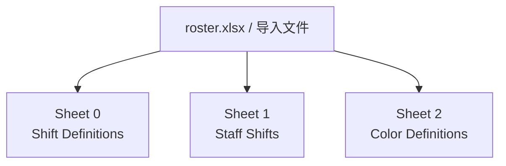
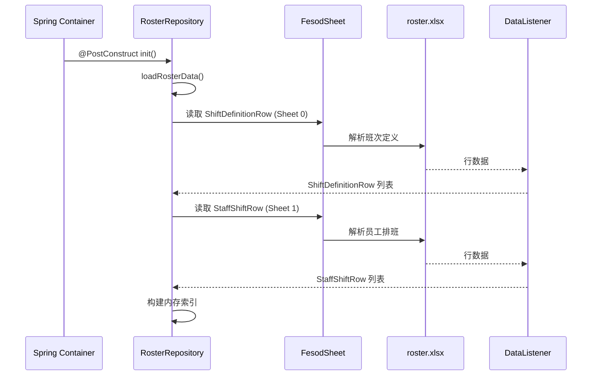
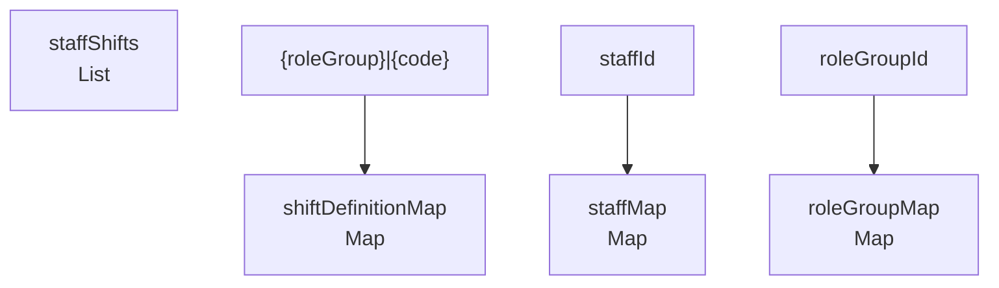

# 数据架构规范

## 文档定位

本文记录系统中与 Excel 数据源相关的结构、加载方式与兼容约束。虽然当前后台主链路以数据库为主，但历史 Excel 结构仍影响导入模板、兼容逻辑与部分只读说明。

## 数据来源概览

- 存储位置：`src/main/resources/roster.xlsx`
- 当前实现说明：应用启动时一次性加载，运行期间不会自动重载 Excel 内容。
- 兼容提醒：Excel 打包在 JAR 中时，运行时修改通常需要重新部署。

## Excel 结构

### Sheet 0：班次定义（Shift Definitions）

对应实体：[`entity/ShiftDefinitionRow.java`](../src/main/java/com/support/server/supportrosterserver/entity/ShiftDefinitionRow.java)

| 列索引 | 字段名 | 类型 | 说明 | 示例 |
|---|---|---|---|---|
| 0 | `roleGroup` | `String` | 角色组名称 | `L1_China` |
| 1 | `code` | `String` | 班次代码 | `A` |
| 2 | `meaning` | `String` | 班次含义 | `00:00-07:00` |
| 3 | `startTime` | `String` | 开始时间 | `00:00:00` |
| 4 | `endTime` | `String` | 结束时间 | `07:00:00` |
| 5 | `timezone` | `String` | 时区代码 | `HKT` |
| 6 | `showOnRosterPage` | `String` | 是否显示 | `Y` / `N` |
| 7 | `remark` | `String` | 备注 | `Primary IM` |

### Sheet 1：员工排班（Staff Shifts）

对应实体：[`entity/StaffShiftRow.java`](../src/main/java/com/support/server/supportrosterserver/entity/StaffShiftRow.java)

| 列索引 | 字段名 | 类型 | 说明 | 示例 |
|---|---|---|---|---|
| 0 | `name` | `String` | 员工姓名 | `test1` |
| 1 | `staffId` | `String` | 员工 ID | `123` |
| 2 | `roleGroup` | `String` | 角色组 | `L1_China` |
| 3 | `region` | `String` | 地区 | `China` |
| 4 | `contact` | `String` | 联系方式 | `+86-xxx` |
| 5 | `notes` | `String` | 备注 |  |
| 6-36 | `day1` - `day31` | `String` | 每日班次代码 | `A`、`B`、`HoL` |

### Sheet 2：颜色定义（Color Definitions）

| 列索引 | 字段名 | 类型 | 说明 | 示例 |
|---|---|---|---|---|
| 0 | `code` | `String` | 班次代码 | `A` |
| 1 | `colorName` | `String` | 颜色名称 | `Orange` |
| 2 | `rgb` | `String` | RGB 值 | `255 165 0` |
| 3 | `hex` | `String` | 十六进制颜色 | `#FFA500` |

> 当前代码中未使用 Sheet 2 的颜色定义；颜色配置仍由前端或 `RosterService.TEAM_MAPPING` 侧处理。

## 加载链路

### 数据监听器

| 监听器 | 作用 | 源码 |
|---|---|---|
| `ShiftDefinitionDataListener` | 收集班次定义行，异常时抛出 `ExcelAnalysisException` | [repository/ShiftDefinitionDataListener.java](../src/main/java/com/support/server/supportrosterserver/repository/ShiftDefinitionDataListener.java) |
| `StaffShiftDataListener` | 收集员工排班行 | [repository/StaffShiftDataListener.java](../src/main/java/com/support/server/supportrosterserver/repository/StaffShiftDataListener.java) |

## 内存索引

| 索引 | 键 | 用途 |
|---|---|---|
| `shiftDefinitionMap` | `{roleGroup}|{code}` | 定位班次定义 |
| `staffMap` | `staffId` | 按员工主键查询 |
| `roleGroupMap` | `roleGroupId` | 查询角色组元数据 |
| `staffShifts` | 列表遍历 | 排班明细扫描 |

## 数据转换规则

| 来源 | 目标 | 说明 |
|---|---|---|
| `ShiftDefinitionRow` | `ShiftDefinition` | `showOnRosterPage` 由 `Y/N` 转为布尔值 |
| `StaffShiftRow` | `StaffShift` | 日历列按 1-31 天填入 `dailyShifts` |
| `Staff` | `StaffDto` | `roleGroups` 由排班记录聚合得到 |

相关源码：[`repository/RosterRepository.java`](../src/main/java/com/support/server/supportrosterserver/repository/RosterRepository.java)、[`service/StaffService.java`](../src/main/java/com/support/server/supportrosterserver/service/StaffService.java)

## 数据质量与运行约束

| 约束 | 当前行为 |
|---|---|
| `staffId` 必须可解析为数字 | 解析失败时，该行会被静默跳过 |
| `staffId` 应唯一 | 遇到重复 `staffId` 时，`staffMap` 采用首条记录 |
| 班次代码需能匹配定义 | 不在定义内的代码可能引发校验问题或回退逻辑 |
| Excel 资源路径 | `ClassPathResource(...).getFile()` 在部分可执行 JAR 形态下需重点验证 |
| 自动刷新 | 启动后不自动重载 Excel |

### 时区代码

| 代码 | ZoneId | 说明 |
|---|---|---|
| `HKT` | `Asia/Hong_Kong` | 香港时间 |
| `IST` | `Asia/Kolkata` | 印度标准时间 |
| `INT` | `UTC` | 国际时间 |

## 迁移备注

- 当前后台主链路已以数据库为主，但 Excel 仍是导入模板与历史结构说明的重要依据。
- 若未来完全移除 Excel 兼容链路，应先确认导入、模板下载与 viewer 历史说明是否已有替代文档。

## 维护提示

- 本文记录“数据来源事实”和“兼容事实”，不是数据库建模规范；数据库规则请见 [db/db-spec.md](./db/db-spec.md)。
- 对已不再使用但仍需兼容的字段，应使用“未使用 / 仅兼容”而不是直接删除说明。
