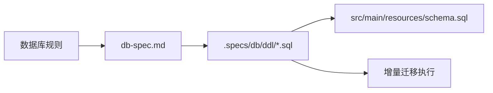

# 数据库设计规范

## 文档定位

本文定义所有数据库表、关联表、字典表与 DDL 的强制规则。若实现需要偏离本文，应先更新规范，再执行结构变更。

## 强制规则总览

| 编号 | 规则 | 强制要求 |
|---|---|---|
| 1 | 主键策略 | 所有表统一使用雪花 ID；Java / MyBatis-Plus 侧使用 `@TableId(type = IdType.ASSIGN_ID)` |
| 2 | 审计字段 | 所有表必须包含 `create_time`、`update_time`，并由数据库自动维护 |
| 3 | DDL 存放 | 所有正式建表与迁移 SQL 必须位于 `.specs/db/ddl/` |
| 4 | 启动初始化兼容 | `src/main/resources/schema.sql` 必须兼容 Spring JDBC `ScriptUtils` 语句切分规则 |

## 主键策略

- 所有表主键列推荐使用可承载雪花 ID 的整型类型，例如 `BIGINT`。
- 禁止以 `AUTO_INCREMENT`、`SERIAL`、序列自增等方案作为默认主键策略。
- 不再额外自研主键生成器，统一复用框架内置雪花 ID 策略。

## 审计字段

- 所有表必须包含：
  - `create_time`
  - `update_time`
- `create_time` 在插入时自动赋值。
- `update_time` 在插入时赋值，并在更新时由数据库自动刷新。
- 若数据库方言不支持 `ON UPDATE CURRENT_TIMESTAMP`，应通过触发器或等效机制保证更新语义。

## DDL 组织方式

- 正式 DDL 统一维护在目录：`.specs/db/ddl/`。
- 建议命名方式：
  - `001_init_tables.sql`
  - `010_create_staff_table.sql`
  - `020_create_shift_table.sql`
- 若一次变更涉及多张表，可按变更批次组织，但不得散落到其他 spec 或临时文档中。

## Spring Boot 运行时初始化兼容性

- 若 `src/main/resources/schema.sql` 作为 Spring Boot 运行时初始化脚本执行，SQL 必须兼容 Spring JDBC `ScriptUtils` 的切分规则。
- PostgreSQL 的 `FUNCTION` / `TRIGGER` 若包含过程体内部分号，不能直接使用 `$$ ... $$` 形式并假定初始化器能自动识别完整函数体。
- 此类函数应改写为 Spring 初始化器可安全执行的形式，或迁移到专用迁移工具中执行。

## 落地检查清单

- [ ] 新表主键是否为雪花 ID。
- [ ] 实体是否使用 `@TableId(type = IdType.ASSIGN_ID)`。
- [ ] 表结构是否包含 `create_time` / `update_time`。
- [ ] 时间字段是否由数据库自动维护。
- [ ] 对应 SQL 是否已存放到 `.specs/db/ddl/`。
- [ ] `schema.sql` 中的 PostgreSQL 函数 / 触发器定义是否兼容 Spring Boot 初始化器。

## 维护提示

- 本文只定义数据库规则，不替代具体 DDL。
- 表结构变更后，应同时检查 feature 文档中的核心表说明是否需要同步更新。
