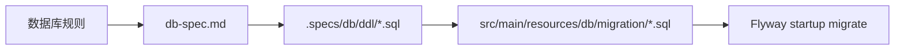

# 数据库设计规范

## 文档定位

本文定义所有数据库表、关联表、字典表与 DDL 的强制规则。若实现需要偏离本文，应先更新规范，再执行结构变更。

## 强制规则总览

| 编号 | 规则 | 强制要求 |
|---|---|---|
| 1 | 主键策略 | 所有表统一使用雪花 ID；Java / MyBatis-Plus 侧使用 `@TableId(type = IdType.ASSIGN_ID)` |
| 2 | 审计字段 | 所有表必须包含 `create_time`、`update_time`，并由数据库自动维护 |
| 3 | DDL 存放 | 所有正式建表与迁移 SQL 必须位于 `.specs/db/ddl/` |
| 4 | 启动迁移机制 | 运行时数据库结构对齐统一由 Flyway 执行，迁移脚本位于 `src/main/resources/db/migration/` |

## 主键策略

- 所有表主键列推荐使用可承载雪花 ID 的整型类型，例如 `BIGINT`。
- 禁止以 `AUTO_INCREMENT`、`SERIAL`、序列自增等方案作为默认主键策略。
- 不再额外自研主键生成器，统一复用框架内置雪花 ID 策略。

## 审计字段

- 所有表必须包含：
  - `create_time`
  - `update_time`
- `create_time` 在插入时自动赋值。
- `update_time` 在插入时赋值，并在更新时由数据库自动刷新。
- 若数据库方言不支持 `ON UPDATE CURRENT_TIMESTAMP`，应通过触发器或等效机制保证更新语义。

## DDL 组织方式

- 正式 DDL 统一维护在目录：`.specs/db/ddl/`。
- 建议命名方式：
  - `001_init_tables.sql`
  - `010_create_staff_table.sql`
  - `020_create_shift_table.sql`
- 若一次变更涉及多张表，可按变更批次组织，但不得散落到其他 spec 或临时文档中。

## Flyway 启动迁移约定

- 运行时数据库结构迁移统一由 Flyway 在应用启动阶段执行。
- 迁移脚本目录为 `src/main/resources/db/migration/`，命名遵循 Flyway 版本规则，例如：
  - `V1__workspace_schema.sql`
  - `V2__add_xxx.sql`
- 面向已有环境的迁移脚本必须保持幂等，避免因重复部署或历史环境差异导致启动失败。
- 若某个低版本迁移是在更高版本已经发布后补入，用于修复历史环境缺口，则该迁移必须保持幂等，并允许在目标库已执行更高版本迁移后补跑成功。
- 当前服务端 Flyway 启动配置启用 `outOfOrder=true`，用于接纳这类“低版本补迁移”场景；该能力只能配合幂等 SQL 使用，不能替代规范化的版本顺序管理。
- 当两个迁移都覆盖同一结构变更时，较低版本脚本负责历史库补齐，较高版本脚本继续保障新环境顺序升级；两者都必须保证重复执行不会破坏已有数据或因重复 DDL 失败。
- PostgreSQL 的 `FUNCTION` / `TRIGGER` 可直接放入 Flyway SQL 中统一管理，不再以 Spring JDBC `schema.sql` 兼容性为约束。
- 若当前环境已存在旧库但尚未建立 Flyway 历史表，应通过 `baseline-on-migrate` 配合版本化迁移平滑接管，而不是继续新增零散的 `@PostConstruct` 补丁。

## 落地检查清单

- [ ] 新表主键是否为雪花 ID。
- [ ] 实体是否使用 `@TableId(type = IdType.ASSIGN_ID)`。
- [ ] 表结构是否包含 `create_time` / `update_time`。
- [ ] 时间字段是否由数据库自动维护。
- [ ] 对应 SQL 是否已存放到 `.specs/db/ddl/`。
- [ ] 对应 Flyway 迁移是否已落到 `src/main/resources/db/migration/`。
- [ ] 迁移脚本是否支持现有环境平滑升级。

## 维护提示

- 本文只定义数据库规则，不替代具体 DDL。
- 表结构变更后，应同时检查 feature 文档中的核心表说明是否需要同步更新。
