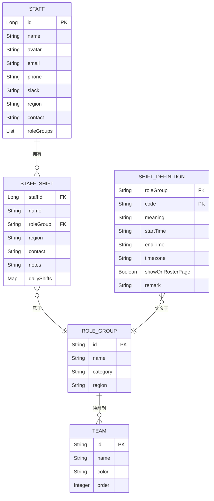
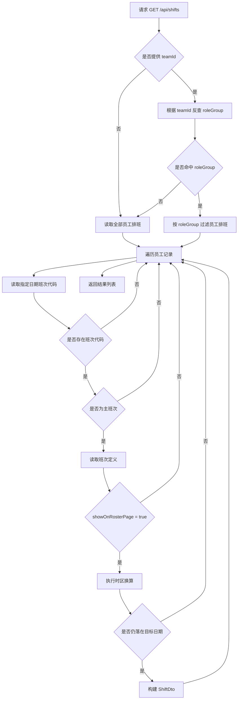
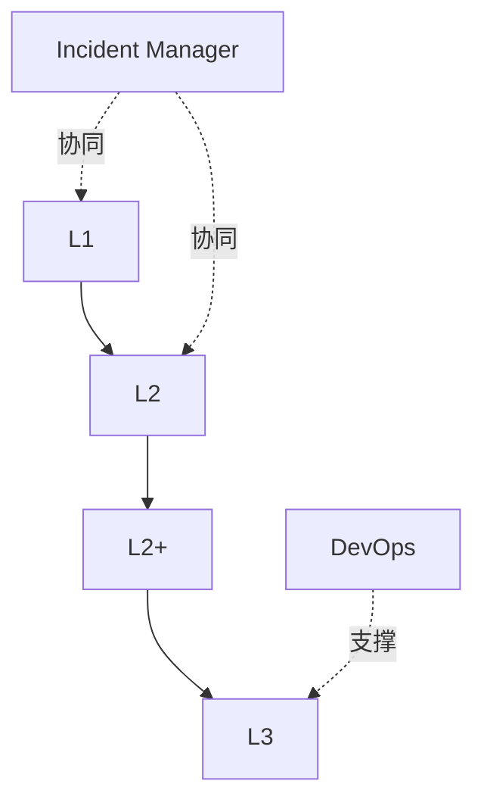

# 领域逻辑规范

## 文档定位

本文描述 Support Roster Server 的核心业务实体、班次判定规则、团队映射与主要流程，用于统一 viewer 与 workspace 两条接口线背后的业务语义。

## 核心实体

### 实体说明

| 实体 | 关键字段 | 说明 | 源码 |
|---|---|---|---|
| `Staff` | `id`、`name`、`region`、`roleGroups` | 员工基础资料与所属分组 | [entity/Staff.java](../src/main/java/com/support/server/supportrosterserver/entity/Staff.java) |
| `StaffShift` | `staffId`、`roleGroup`、`dailyShifts` | 员工在一个月内的日级排班记录 | [entity/StaffShift.java](../src/main/java/com/support/server/supportrosterserver/entity/StaffShift.java) |
| `ShiftDefinition` | `roleGroup`、`code`、`timezone`、`showOnRosterPage` | 班次定义与显示控制 | [entity/ShiftDefinition.java](../src/main/java/com/support/server/supportrosterserver/entity/ShiftDefinition.java) |
| `RoleGroup` | `id`、`category`、`region` | 历史分组语义，仍用于部分兼容链路 | [entity/RoleGroup.java](../src/main/java/com/support/server/supportrosterserver/entity/RoleGroup.java) |
| `Team` | `id`、`name`、`color`、`order` | 对外展示与后台管理的主分组维度 | 由 [service/RosterService.java](../src/main/java/com/support/server/supportrosterserver/service/RosterService.java) 中映射表参与输出 |

## 核心规则

### 团队与角色组映射

定义位置：[`service/RosterService.java`](../src/main/java/com/support/server/supportrosterserver/service/RosterService.java) `TEAM_MAPPING`

| 角色组 `roleGroup` | 团队 ID | 团队名称 | 颜色 | 顺序 |
|---|---|---|---|---|
| `Incident_Manager_China` | `incident-manager` | Incident Manager | orange | 0 |
| `Incident_Manager_India` | `incident-manager` | Incident Manager | orange | 0 |
| `L1_China` | `l1` | L1 | blue | 1 |
| `L1_India` | `l1` | L1 | blue | 1 |
| `AP_L2` | `ap-l2` | AP L2 | green | 2 |
| `EMEA_L2` | `emea-l2` | EMEA L2 | purple | 3 |
| `MDP_L2` | `mdp-l2` | MDP L2 | red | 4 |
| `AP_L2+` | `ap-l2-plus` | AP L2+ | green | 5 |
| `AP_L3` | `ap-l3` | AP L3 | green | 6 |
| `DevOps_China` | `devops` | DevOps | orange | 7 |
| `DevOps_India` | `devops` | DevOps | orange | 7 |

> 说明：多个 `roleGroup` 可能映射到同一个 `teamId`。当前实现中，按 `teamId` 查询时只会选择首个匹配 `roleGroup`，而不是合并团队下全部 `roleGroup`。

### 主班次判定

定义位置：[`service/RosterService.java`](../src/main/java/com/support/server/supportrosterserver/service/RosterService.java) `PRIMARY_CODES`

主班次集合：`{OC, DS, NS, A, B, D}`

| 班次代码 | 含义 | 是否主班次 |
|---|---|---|
| `A` | 00:00-07:00 通宵班 | 是 |
| `B` | 06:30-15:30 早班 | 是 |
| `C` | 08:00-17:00 正常班 | 否 |
| `D` | 15:30-00:30 晚班 | 是 |
| `DS` | Day Shift | 是 |
| `NS` | Night Shift | 是 |
| `OC` | Full Day Oncall | 是 |
| `BH` | Business Hours | 否 |
| `HoL` | Holiday or Leave | 否 |

### 时区映射

定义位置：[`service/RosterService.java`](../src/main/java/com/support/server/supportrosterserver/service/RosterService.java) `getZoneId()`

| 代码 | ZoneId | 说明 |
|---|---|---|
| `HKT` | `Asia/Hong_Kong` | 香港时间 |
| `IST` | `Asia/Kolkata` | 印度标准时间 |
| `INT` | `UTC` | 国际时间 |

### 其他生成规则

| 规则 | 定义位置 | 内容 |
|---|---|---|
| 班次 ID | `buildShiftId()` | `UUID.nameUUIDFromBytes("{staffId}|{shiftCode}|{date}".getBytes(UTF-8))` |
| 头像 URL | [`service/AvatarUrlResolver.java`](../src/main/java/com/support/server/supportrosterserver/service/AvatarUrlResolver.java) | `{support.avatar.base-url}/{first4_of_staffCode}/{staffCode}.jpg` |
| 跨天班次 | `RosterService` 时间计算逻辑 | `endTime < startTime` 时结束时间顺延到次日 |

## 业务流程

### 按日期获取排班

### 班次时间计算

| 步骤 | 说明 |
|---|---|
| 1 | 把 `startTime` / `endTime` 解析为 `LocalTime` |
| 2 | 根据班次时区代码解析 `ZoneId` |
| 3 | 根据请求目标时区解析 `ZoneId` |
| 4 | 组合开始时间与结束时间 |
| 5 | 若 `endTime < startTime`，结束时间顺延一天 |
| 6 | 转换到目标时区后输出 `OffsetDateTime` |

## 支持层级与边界

- 当前代码中未显式实现 L1 → L2 → L3 的升级逻辑，此处仅表达支持层级关系。
- 排班日期范围按 1-31 日建模，当前不支持跨月排班结构。

## 当前边界条件

- `teamId` 无法映射到任意 `roleGroup` 时，不报错，而是退化为查询全部排班。
- `timezone` 参数非法时，当前实现可能抛出异常并返回 `500 Internal Server Error`。
- 当 `ShiftDefinition` 缺失时，班次仍可能被返回，并走默认含义 / 默认时区逻辑。

## 维护提示

- 若团队映射、主班次集合或时区代码发生变化，应优先更新本文，再同步接口与测试。
- 本文中的 `roleGroup` 语义属于历史兼容事实，不应在重写文档时被误删。
