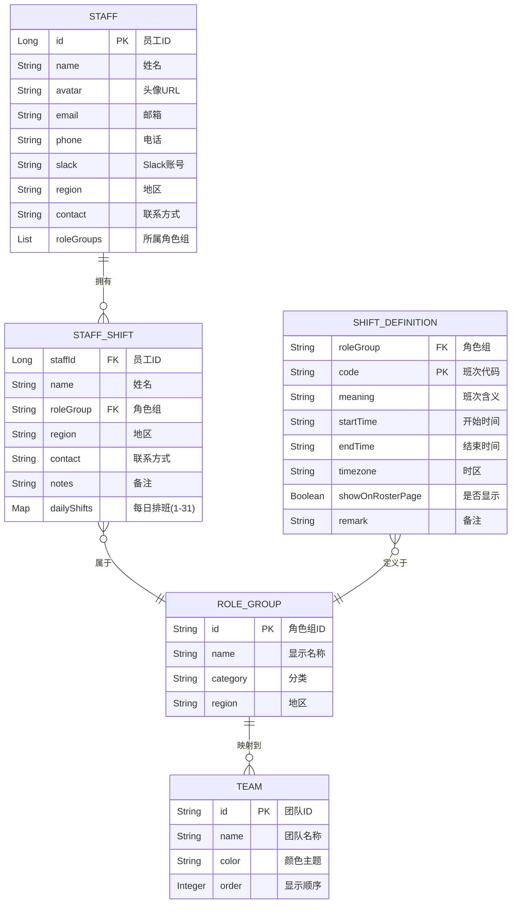
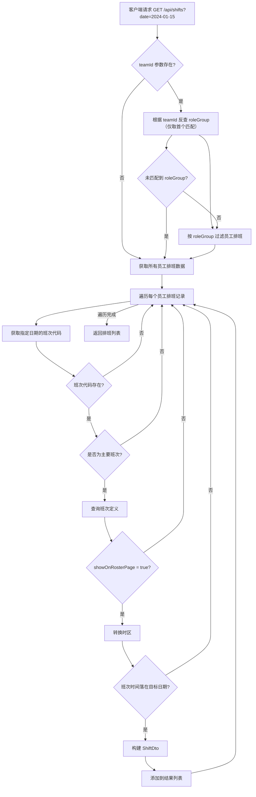
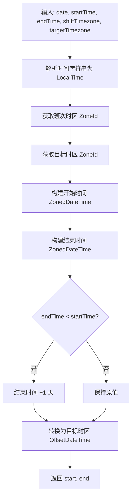
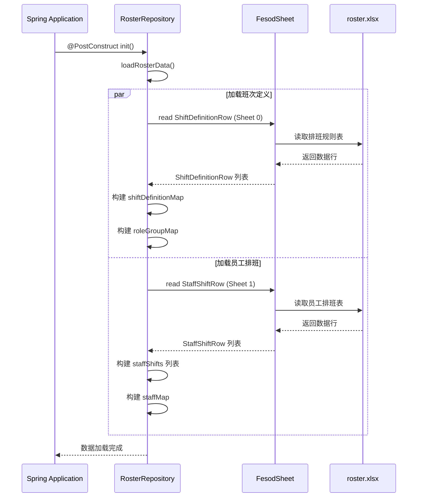
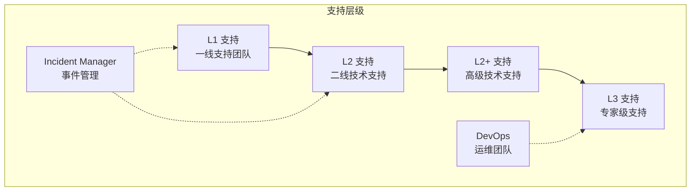

# 业务逻辑规范 (Domain Logic)

## 核心业务实体

### 实体关系图



### 实体定义详解

#### 1. Staff（员工）

**文件位置**: [entity/Staff.java](../src/main/java/com/support/server/supportrosterserver/entity/Staff.java)

| 字段 | 类型 | 说明 |
|------|------|------|
| `id` | `Long` | 唯一员工标识 |
| `name` | `String` | 员工姓名 |
| `avatar` | `String` | 头像 URL（可为空，当前仓库未在 Staff 实体中填充默认头像） |
| `email` | `String` | 邮箱地址 |
| `phone` | `String` | 电话号码 |
| `slack` | `String` | Slack 账号 |
| `region` | `String` | 所属地区 |
| `contact` | `String` | 联系方式 |
| `roleGroups` | `List<String>` | 所属角色组列表 |

#### 2. StaffShift（员工排班）

**文件位置**: [entity/StaffShift.java](../src/main/java/com/support/server/supportrosterserver/entity/StaffShift.java)

| 字段 | 类型 | 说明 |
|------|------|------|
| `staffId` | `Long` | 员工 ID |
| `name` | `String` | 员工姓名 |
| `roleGroup` | `String` | 角色组名称 |
| `region` | `String` | 地区 |
| `contact` | `String` | 联系方式 |
| `notes` | `String` | 备注信息 |
| `dailyShifts` | `Map<Integer, String>` | 每日排班映射（key: 1-31, value: 班次代码） |

**核心方法**:
- `getShiftCodeByDay(int day)`: 获取指定日期的班次代码
- `setShiftCodeByDay(int day, String code)`: 设置指定日期的班次

#### 3. ShiftDefinition（班次定义）

**文件位置**: [entity/ShiftDefinition.java](../src/main/java/com/support/server/supportrosterserver/entity/ShiftDefinition.java)

| 字段 | 类型 | 说明 |
|------|------|------|
| `roleGroup` | `String` | 角色组名称 |
| `code` | `String` | 班次代码（A/B/C/D/DS/NS/OC/BH/HoL） |
| `meaning` | `String` | 班次含义描述 |
| `startTime` | `String` | 班次开始时间（HH:mm:ss） |
| `endTime` | `String` | 班次结束时间（HH:mm:ss） |
| `timezone` | `String` | 时区代码（HKT/IST/INT） |
| `showOnRosterPage` | `Boolean` | 是否在排班页显示 |
| `remark` | `String` | 备注信息 |

#### 4. RoleGroup（角色组）

**文件位置**: [entity/RoleGroup.java](../src/main/java/com/support/server/supportrosterserver/entity/RoleGroup.java)

| 字段 | 类型 | 说明 |
|------|------|------|
| `id` | `String` | 角色组 ID（如 `L1_China`） |
| `name` | `String` | 显示名称（如 `L1 China`） |
| `category` | `String` | 分类（L1/L2/L2+/L3/Incident_Manager/DevOps） |
| `region` | `String` | 地区（China/India/AP/EMEA/MDP） |

---

## 核心业务流程

### 1. 按日期获取排班流程



### 2. 班次时间计算流程



### 3. 数据初始化流程



---

## 关键业务规则

### 1. 角色组分类与团队映射

**定义位置**: [service/RosterService.java](../src/main/java/com/support/server/supportrosterserver/service/RosterService.java) `TEAM_MAPPING`

| 角色组 (roleGroup) | 团队 ID | 团队名称 | 颜色 | 显示顺序 |
|-------------------|---------|---------|------|---------|
| `Incident_Manager_China` | `incident-manager` | Incident Manager | orange | 0 |
| `Incident_Manager_India` | `incident-manager` | Incident Manager | orange | 0 |
| `L1_China` | `l1` | L1 | blue | 1 |
| `L1_India` | `l1` | L1 | blue | 1 |
| `AP_L2` | `ap-l2` | AP L2 | green | 2 |
| `EMEA_L2` | `emea-l2` | EMEA L2 | purple | 3 |
| `MDP_L2` | `mdp-l2` | MDP L2 | red | 4 |
| `AP_L2+` | `ap-l2-plus` | AP L2+ | green | 5 |
| `AP_L3` | `ap-l3` | AP L3 | green | 6 |
| `DevOps_China` | `devops` | DevOps | orange | 7 |
| `DevOps_India` | `devops` | DevOps | orange | 7 |

**[Warning]** 多个角色组可能映射到同一个团队 ID（如 `Incident_Manager_China` 和 `Incident_Manager_India` 都映射到 `incident-manager`）。

**当前实现细节**：当 `teamId` 查询时，代码只会选择第一个匹配的 `roleGroup` 进行过滤，而不是合并该团队下所有 `roleGroup`。

### 2. 主要班次判定

**定义位置**: [service/RosterService.java](../src/main/java/com/support/server/supportrosterserver/service/RosterService.java) `PRIMARY_CODES`

主要班次代码集合：`{"OC", "DS", "NS", "A", "B", "D"}`

| 代码 | 含义 | 是否主要 |
|------|------|---------|
| `A` | 00:00-07:00 通宵班 | ✅ |
| `B` | 06:30-15:30 早班 | ✅ |
| `C` | 08:00-17:00 正常班 | ❌ |
| `D` | 15:30-00:30 晚班 | ✅ |
| `DS` | Day Shift 日班 | ✅ |
| `NS` | Night Shift 夜班 | ✅ |
| `OC` | Full Day Oncall 全天待命 | ✅ |
| `BH` | Business Hours 工作时间 | ❌ |
| `HoL` | Holiday or Leave 假期 | ❌ |

### 3. 时区转换规则

**定义位置**: [service/RosterService.java](../src/main/java/com/support/server/supportrosterserver/service/RosterService.java) `getZoneId()`

| 时区代码 | ZoneId | UTC 偏移 |
|---------|--------|---------|
| `HKT` | `Asia/Hong_Kong` | UTC+8 |
| `IST` | `Asia/Kolkata` | UTC+5:30 |
| `INT` | `UTC` | UTC+0 |

### 4. 班次 ID 生成规则

**定义位置**: [service/RosterService.java](../src/main/java/com/support/server/supportrosterserver/service/RosterService.java) `buildShiftId()`

```
shiftId = UUID.nameUUIDFromBytes("{staffId}|{shiftCode}|{date}".getBytes(UTF-8))
```

示例：`staffId=123, code=A, date=2024-01-15` → 生成确定性 UUID

### 5. 头像生成规则

**定义位置**: [service/RosterService.java](../src/main/java/com/support/server/supportrosterserver/service/RosterService.java) `generateAvatarUrl()`

```java
avatarIndex = (staffId % 8) + 1
avatar = AVATARS[(avatarIndex - 1) % 8]
```

**[Warning]** 当前使用 Unsplash 占位图，实际生产环境应替换为真实头像系统

---

## 支持层级体系



### 升级机制 [TBD]

**[Warning]** 当前代码中未明确实现 L1→L2→L3 的升级逻辑，需后续补充

---

## 业务约束

### 1. 排班日期范围

- 支持日期：每月 1-31 日
- 跨月排班：当前不支持（数据结构限制）

### 2. 跨天班次处理

当 `endTime < startTime` 时，自动将结束日期 +1 天：
- 例如：`D` 班次 15:30-00:30，实际结束时间为次日 00:30

### 3. 班次过滤规则

返回的班次需满足：
1. 班次代码在 `PRIMARY_CODES` 集合中
2. 若存在 `ShiftDefinition`，则 `ShiftDefinition.showOnRosterPage = true`
3. 班次时间落在请求的目标日期（考虑时区转换后）

### 4. 边界条件（当前实现）

- `teamId` 无法映射到任意 `roleGroup` 时，不报错，退化为查询全部员工排班。
- `timezone` 参数非法（`ZoneId.of(...)` 无法解析）时，会抛出异常并返回 `500 Internal Server Error`。
- 若某条排班的 `ShiftDefinition` 缺失，班次仍可能被返回，并使用默认含义与默认时区逻辑。
