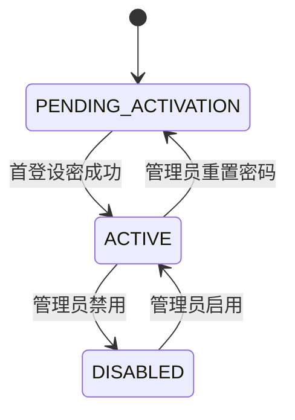

# 账号与授权数据模型

## 设计原则

- 员工资料与认证凭据分离。
- 角色与 team 范围独立建模，避免把复杂授权塞进单字段。
- 数据模型需兼容未来公司 SSO，不因本地密码方案而锁死。

## 核心表

### `workspace_account`

| 字段 | 类型 | 说明 |
|---|---|---|
| `id` | `BIGINT` | 主键，雪花 ID |
| `staff_id` | `BIGINT` | 关联 `workspace_staff.id` |
| `staff_code` | `VARCHAR(128)` | 冗余登录标识，便于唯一约束和查询 |
| `role_code` | `VARCHAR(32)` | `admin` / `editor` / `readonly` |
| `account_status` | `VARCHAR(32)` | `PENDING_ACTIVATION` / `ACTIVE` / `DISABLED` |
| `password_hash` | `VARCHAR(255)` | 本地密码哈希 |
| `password_set_at` | `TIMESTAMP` | 首次设密或最近一次重置完成时间 |
| `auth_source` | `VARCHAR(32)` | `LOCAL_PASSWORD`，未来可扩展 `CORP_SSO` |
| `external_subject` | `VARCHAR(255)` | 未来 SSO 的外部主体标识 |
| `notes` | `TEXT` | 管理备注 |
| `last_login_at` | `TIMESTAMP` | 最近成功登录时间 |
| `deleted` | `INTEGER` | 逻辑删除 |
| `create_time` / `update_time` | `TIMESTAMP` | 审计字段 |

约束：

- `staff_id` 唯一，确保一个 staff 仅有一个账号。
- `staff_code` 唯一，便于用 `staffid` 登录。
- `password_hash` 在 `PENDING_ACTIVATION` 阶段可为空，其余激活状态必须有值。

### `workspace_account_team_scope`

| 字段 | 类型 | 说明 |
|---|---|---|
| `id` | `BIGINT` | 主键，雪花 ID |
| `account_id` | `BIGINT` | 关联账号 |
| `team_id` | `BIGINT` | 关联 `workspace_team.id` |
| `create_time` / `update_time` | `TIMESTAMP` | 审计字段 |

约束：

- `(account_id, team_id)` 唯一。
- 仅当 `role_code = editor` 时要求配置 team scope；`admin` 可不落 scope，`readonly` 默认忽略 scope。

## 状态机

## 与现有主数据的关系

- `workspace_staff` 继续承载姓名、邮箱、手机号、team、时区等业务资料。
- `workspace_account` 仅承载登录与权限语义。
- staff 删除前应先评估账号依赖；实现上可限制“有账号的 staff 不允许删除”，或在删除 staff 时同步逻辑删除账号。

## SSO 预留

即使首期只启用本地密码，仍保留以下扩展点：

- `auth_source`
- `external_subject`
- `password_hash` 可为空
- `staff_code` 继续作为内部业务主键，与外部身份标识解耦

## DDL 组织

- 正式 DDL 文件放入 `.specs/db/ddl/005_workspace_auth_tables.sql`。
- 运行时数据库结构由 Flyway 迁移接管，对应脚本需同步合并到 `src/main/resources/db/migration/`。
