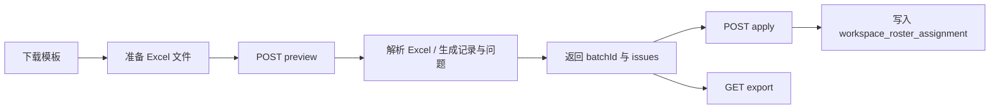

# Workspace Import Export

## 文档定位

本文描述工作台导入导出资源的完整链路，包括预览、应用、导出与模板下载四类能力，以及它们与批次、校验和月度上下文的关系。

## 资源范围

- `POST /api/workspace/import-export/preview`
- `POST /api/workspace/import-export/{batchId}/apply`
- `GET /api/workspace/import-export/export`
- `GET /api/workspace/import-export/template`

controller：`WorkspaceImportExportController`

## 流程图

## 契约与源码映射

| 类型 | 位置 |
|---|---|
| OpenAPI 路径 | [api/paths/workspace/import-export.yaml](../../../api/paths/workspace/import-export.yaml) |
| Controller | [WorkspaceImportExportController.java](../../../src/main/java/com/support/server/supportrosterserver/controller/workspace/WorkspaceImportExportController.java) |
| Service | [WorkspaceImportService.java](../../../src/main/java/com/support/server/supportrosterserver/service/workspace/WorkspaceImportService.java) |
| 预览响应 | [WorkspaceImportPreviewResponse.java](../../../src/main/java/com/support/server/supportrosterserver/dto/workspace/WorkspaceImportPreviewResponse.java) |
| 应用响应 | [WorkspaceImportApplyResponse.java](../../../src/main/java/com/support/server/supportrosterserver/dto/workspace/WorkspaceImportApplyResponse.java) |

## 预览阶段

导入文件必须遵循 `spec/source_excel.md` 中当前 3 个 sheet 的格式约定。

预览阶段负责：

1. 解析 Excel 内容。
2. 生成导入记录与问题记录。
3. 返回批次号、有效记录数、无效记录数、问题列表。

预览阶段不直接写入正式排班表。

## 应用阶段

应用接口仅对已预览批次执行正式写入：

1. 校验批次状态。
2. 将有效记录写入 `workspace_roster_assignment`。
3. 更新批次状态与操作日志。

## 导出与模板下载

- 导出接口按 `year`、`month` 输出 Excel 工作簿，供管理员直接再次导入或离线核对。
- 月排班工作簿中的 `Monthly Roster` sheet 固定包含 `staff_id`、`team`、`name` 与 `1-31` 日期列；`name` 仅用于人工核对，不改变 staff 的主匹配键。
- 模板文件位于 `src/main/resources/roster.xlsx`。
- 模板下载响应头固定为附件下载：`import-template.xlsx`。

### 模板结构

| Sheet Index | Sheet Name | 说明 |
|---|---|---|
| 0 | Shift Definitions | 班次定义，包含 `team`、`code`、`meaning`、`start_time`、`end_time`、`timezone`、`show_on_roster_page`、`remark` |
| 1 | Staff Shifts | 员工班次；简化月排班 sheet 至少包含 `staff_id`、`team`、`name` 与 `1-31` 天列 |
| 2 | Color Definitions | 颜色定义，包含 `code`、`color_name`、`rgb`、`hex` |

## 资源约束

- 导入预览与应用必须通过 `batchId` 建立批次关联。
- `batchId` 在 JSON 中按字符串传输，避免前端精度丢失。
- 预览问题列表与校验中心问题模型保持一致。
- 重新读取导出/模板工作簿时，服务端必须兼容 `name` 列引入后的日期列偏移，避免把第 1 天班次读丢。
- `operator` 可选，用于批次与日志记录。
- 导入预览返回的 `shiftCodeOptionsByTeam` 需要遵循班次定义页保存的 TEAM 维度顺序，避免预览下拉与工作台显示不一致。

## 导入验证规则

### 批次状态判定

- `VALIDATED`：无 `high` 或 `medium` 级别问题，可执行应用。
- `INVALID`：存在 `high` 或 `medium` 级别问题，阻止应用。

### 问题严重级别

| 级别 | 说明 | 是否阻止导入 |
|---|---|---|
| `high` | 严重错误，如数据格式错误、必填字段缺失 | 是 |
| `medium` | 中等问题，如映射失败、数据不完整 | 是 |
| `low` | 轻微警告，如 `Missing Primary Coverage` | 否 |

### 数据过滤规则

导入时自动过滤以下无效行：

- 标题行（`team` 列为 `team`）
- 空行（`team` 或 `code` 为空）
- 非班次定义行（`start_time`、`end_time`、`timezone` 均为空）
- 颜色定义混入数据（`start_time` 以 `#` 开头）

## 请求字段与 DTO 映射

### 预览请求字段

| 请求字段 | 输入位置 | 控制器参数 | 响应 DTO 字段 | 必填 | 说明 |
|---|---|---|---|---|---|
| `file` | multipart | `MultipartFile file` | 无直接同名字段 | 是 | Excel 文件 |
| `year` | form/query | `Integer year` | `year` | 是 | 年份 |
| `month` | form/query | `Integer month` | `month` | 是 | 月份 |
| `operator` | form/query | `String operator` | 无直接同名字段 | 否 | 操作人 |

### 应用请求字段

| 请求字段 | 输入位置 | 控制器参数 | 响应 DTO 字段 | 必填 | 说明 |
|---|---|---|---|---|---|
| `batchId` | path | `Long batchId` | `batchId` | 是 | 导入批次主键，JSON 中按字符串传输 |
| `operator` | query | `String operator` | 无直接同名字段 | 否 | 操作人 |

### 导出请求字段

| 请求字段 | 输入位置 | 控制器参数 | 必填 | 说明 |
|---|---|---|---|---|
| `year` | query | `Integer year` | 是 | 年份 |
| `month` | query | `Integer month` | 是 | 月份 |

## 维护提示

- 若模板格式、校验级别或批次状态语义变化，必须同步更新本文、前端 Import / Export spec 与 OpenAPI 文档。
- 若未来支持浏览器内字段映射修复，应新增独立章节，而不是把交互细节堆进资源总览。
