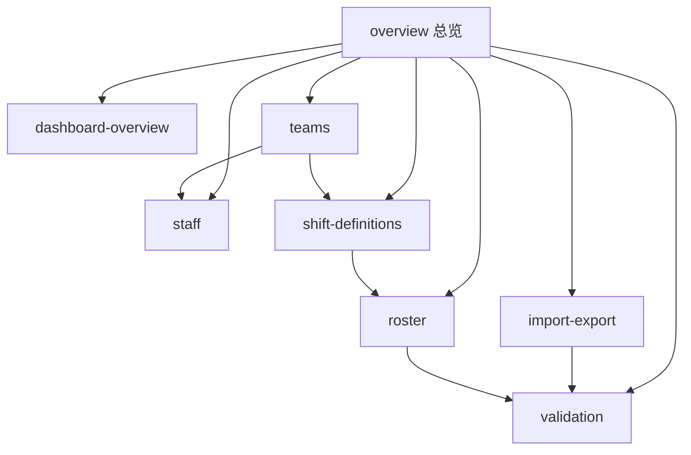

# Workspace Admin 总览

## 文档定位

本文是 `/api/workspace/**` 管理接口的总览章节，用于建立后台能力边界、资源关系、核心表与跨资源约束。资源级字段映射与接口细节继续下沉到 `workspace-admin/` 子文档。

## 能力边界

workspace 后台统一覆盖以下资源：

- 总览看板
- 人员目录
- 班次定义
- 团队管理
- 月度排班
- 校验中心
- Excel 导入导出

## 资源地图

## 契约与源码入口

| 类型 | 位置 |
|---|---|
| OpenAPI 聚合入口 | [api/openapi.yaml](../../../api/openapi.yaml) |
| workspace 路径目录 | [api/paths/workspace](../../../api/paths/workspace) |
| Controller 目录 | [src/main/java/com/support/server/supportrosterserver/controller/workspace](../../../src/main/java/com/support/server/supportrosterserver/controller/workspace) |
| Service 目录 | [src/main/java/com/support/server/supportrosterserver/service/workspace](../../../src/main/java/com/support/server/supportrosterserver/service/workspace) |
| DTO 目录 | [src/main/java/com/support/server/supportrosterserver/dto/workspace](../../../src/main/java/com/support/server/supportrosterserver/dto/workspace) |

## 技术基线

| 主题 | 当前选型 | 说明 |
|---|---|---|
| 数据库 | `PostgreSQL` | workspace 主存储 |
| ORM | `MyBatis-Plus` | mapper 与实体持久化 |
| 主键 | 雪花 ID | 对外以字符串传输 Long |
| 审计字段 | `create_time` / `update_time` | 所有核心表统一要求 |
| 初始化 | `Flyway` + `.specs/db/ddl/*.sql` | 应用启动自动执行版本化迁移，DDL spec 目录仍作为正式设计来源 |

## 核心表

| 表名 | 作用 |
|---|---|
| `workspace_team` | 团队主数据、顺序、颜色、显示状态 |
| `workspace_staff` | 人员主数据 |
| `workspace_shift_definition` | 班次定义主数据 |
| `workspace_roster_assignment` | 月排班事实表 |
| `workspace_import_batch` | 导入批次 |
| `workspace_import_record` | 导入预览记录 |
| `workspace_import_issue` | 导入与校验问题 |
| `workspace_operation_log` | 后台关键操作日志 |

遗留兼容说明：`workspace_role_group`、`workspace_team_role_group_rel` 与部分 `role_group_id` 列仍可能存在，但主链路已统一迁移到 `team` 维度。

## 跨资源约束

- 月排班按“员工 + 自然日 + 班次编码”保存，不使用整月 JSON 覆盖存储。
- 校验问题既服务导入预览，也服务校验中心接口。
- viewer 只读接口继续通过服务层适配输出，不与 workspace 写接口合并。
- Long 主键对外按字符串传输，避免浏览器精度问题。

## 继续阅读

- [dashboard-overview.md](./dashboard-overview.md)
- [staff.md](./staff.md)
- [shift-definitions.md](./shift-definitions.md)
- [teams.md](./teams.md)
- [roster.md](./roster.md)
- [validation.md](./validation.md)
- [import-export.md](./import-export.md)
- [role-groups.md](./role-groups.md)

## 维护提示

- 本页只保留后台共性事实与资源关系，不堆叠资源级字段明细。
- 若新增 workspace 资源，需同步更新本页资源地图、`_index.md` 目录与 OpenAPI 路径组织。
