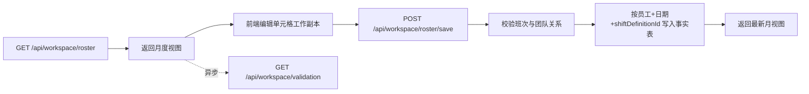

# Workspace Roster

## 文档定位

本文描述月度排班资源的查询、保存、存储语义与数据边界，重点说明后台如何以“月视图 + 增量更新”的方式组织排班编辑链路。

## 资源范围

- `GET /api/workspace/roster`
- `POST /api/workspace/roster/save`

controller：`WorkspaceRosterController`

## 流程图

## 契约与源码映射

| 类型 | 位置 |
|---|---|
| OpenAPI 路径 | [api/paths/workspace/roster.yaml](../../../api/paths/workspace/roster.yaml) |
| Controller | [WorkspaceRosterController.java](../../../src/main/java/com/support/server/supportrosterserver/controller/workspace/WorkspaceRosterController.java) |
| Service | [WorkspaceRosterService.java](../../../src/main/java/com/support/server/supportrosterserver/service/workspace/WorkspaceRosterService.java) |
| 响应 DTO | [WorkspaceMonthlyRosterResponse.java](../../../src/main/java/com/support/server/supportrosterserver/dto/workspace/WorkspaceMonthlyRosterResponse.java) |
| 保存请求 | [WorkspaceRosterSaveRequest.java](../../../src/main/java/com/support/server/supportrosterserver/dto/workspace/WorkspaceRosterSaveRequest.java) |
| 单元格请求 | [WorkspaceRosterCellUpdateRequest.java](../../../src/main/java/com/support/server/supportrosterserver/dto/workspace/WorkspaceRosterCellUpdateRequest.java) |

## 查询语义

- 查询参数：`year`、`month`，均为可选。
- 返回模型：`WorkspaceMonthlyRosterResponse`。
- 响应按团队分组输出 `groups`，每组包含人员和按日排班 `schedule`。
- 额外返回 `shiftDetailsByTeam`，供前端 hover 时展示班次含义、时间窗口、时区与跨天信息。
- `GET /api/workspace/roster` 应聚焦月视图主数据装配，不在主查询链路内同步执行 live validation，以降低大月视图首屏延迟。

## 保存语义

- 保存请求体包含 `year`、`month` 与 `updates`。
- 每条 `updates` 表示一个“员工 + 日期单元格”的增量修改，而非整月覆盖。
- 保存成功后返回最新整月视图，避免前端只局部拼装回包。
- 校验提示由 `GET /api/workspace/validation` 独立提供，前端可在月视图渲染完成后以 `summaryOnly=true` 异步拉取摘要与最高优先级的 `high` 问题；若没有 `high` 问题则不显示主警告。

## 存储约定

- 排班事实按“员工 + 自然日 + `shiftDefinitionId`”粒度保存，并保留 `shiftCode` 作为冗余快照。
- 不使用整月 JSON 覆盖式存储。
- 班次存在性校验基于“团队 + 班次定义关联关系”，而不是 `workspace_shift_definition.team_id` 单字段。
- 月视图展示班次编码时，以 assignment 关联到的最新班次定义为准，因此 `code` 改名会反映到历史格子。
- `shiftCodeOptionsByTeam` 与 `shiftDetailsByTeam` 内的班次顺序应遵循 `workspace_shift_definition_team_rel.display_order`，以便与班次定义页拖拽结果一致。
- 校验中心若带入 `focusStaffId` + `focusDay`，前端可以直接定位到对应单元格；服务端需稳定返回按 staff 分组、按自然日索引的月视图，保证该类精准跳转可复用。

## 资源约束

- `updates[].staffId` 必须引用已存在人员。
- Long 主键对外按字符串传输，服务端再转换为 `Long`。
- `shiftCode` 要么匹配有效班次定义，要么符合清空单元格的服务层约定。
- 校验结果通过校验中心接口体现；`WorkspaceMonthlyRosterResponse.validationWarning` 仅保留兼容字段，不应作为实时校验结果的唯一来源。

## 请求字段与 DTO 映射

### 查询参数

| 接口 | 输入位置 | 字段 | 控制器参数 | 必填 | 说明 |
|---|---|---|---|---|---|
| `GET /api/workspace/roster` | query | `year` | `Integer year` | 否 | 年份 |
| `GET /api/workspace/roster` | query | `month` | `Integer month` | 否 | 月份 |

### 保存请求字段

| 请求字段 | Request DTO | Response DTO 字段 | 必填 | 说明 |
|---|---|---|---|---|
| `year` | `WorkspaceRosterSaveRequest.year` | `year` | 是 | 年份 |
| `month` | `WorkspaceRosterSaveRequest.month` | `month` | 是 | 月份 |
| `updates` | `WorkspaceRosterSaveRequest.updates` | 无直接同名字段 | 是 | 单元格更新列表 |
| `updates[].staffId` | `WorkspaceRosterCellUpdateRequest.staffId` | `groups[].staff[].staffId` | 是 | 人员主键，JSON 中按字符串传输 |
| `updates[].day` | `WorkspaceRosterCellUpdateRequest.day` | `groups[].staff[].schedule` 的 key | 是 | 月内天数 |
| `updates[].shiftCode` | `WorkspaceRosterCellUpdateRequest.shiftCode` | `groups[].staff[].schedule` 的 value | 否 | 班次编码 |

### 响应 DTO 字段

| DTO 字段 | OpenAPI 字段 | 说明 |
|---|---|---|
| `year` | `year` | 年份 |
| `month` | `month` | 月份 |
| `groups` | `groups` | 团队分组列表，映射 `WorkspaceRosterGroupDto` |
| `shiftCodeOptions` | `shiftCodeOptions` | 全局可选班次编码 |
| `shiftCodeOptionsByTeam` | `shiftCodeOptionsByTeam` | 团队维度的可选班次编码 |
| `shiftDetailsByTeam` | `shiftDetailsByTeam` | 团队维度的班次详细元数据 |
| `validationWarning` | `validationWarning` | 兼容保留字段；实时月排班告警应从校验中心接口获取 |

## 维护提示

- 若保存策略从“增量更新”改为其他模式，必须同步修订本文、前端 Monthly Roster spec 与 OpenAPI 契约。
- 若 `shiftDetailsByTeam`、主查询性能策略或 `validationWarning` 兼容语义变化，应同时更新前后端相关文档。
